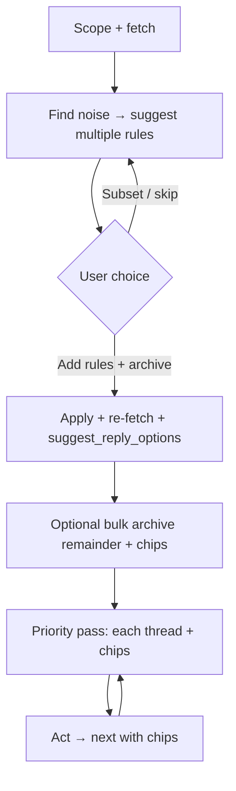

# Inbox triage

Use the same **mail and inbox tools** as the main assistant (**list_inbox**, **search_index**, **read_email**, **archive_emails**, **inbox_rules**, **draft** / **send** where allowed). This skill is a **phased, proactive playbook**: reduce noise in batches first, then invest attention where it matters—turn by turn until the user stops or the scoped queue is empty.

**Mindset — “magical” here means:** you **fetch and scan first** (do not make the user enumerate mail), you **name patterns** (senders, subjects, “looks like X”), you **order by impact** (what unblocks the user or prevents mistakes first), and you **default to one strong primary action** on every `suggest_reply_options` call while still offering **subset, skip, and custom** exits.

**Reassurance (say it when archiving or rules apply):** mail stays **indexed**; **search_index** and **read_email** still find it. Archiving and rules **change what surfaces first**, not what exists. The user can **recover** anything by search or re-opening—**nothing is thrown away** by this flow unless they explicitly ask for **delete** (if your tools allow) and you confirm.

---

## CRITICAL: Keep iterating with chips (every triage turn)

**Do not** end a triage turn with only prose like “If you want, I can keep going” or “Let me know what to do next.” The user is in a **flow**; they need **tappable next steps**.

1. **Same turn, after tool results** — Whenever you have **just applied** rules, archive calls, or any batch that **changes** inbox state, you **must** in **that same assistant turn** (after the summary):
   - **Re-fetch** the inbox in scope if needed, then
   - Call **`suggest_reply_options`** with **2–5 options** (primary + alternates) so the user can **continue in one tap**.

2. **Post–rules / post–batch archive (mandatory handoff)** — After adding rules and/or archiving matches, the **very next** thing you output for choice must be **`suggest_reply_options`**, not an open question. Examples of **labels** (tailor to the actual remainders):
   - **Primary:** “Triage what’s left: start with top priority” — `submit` should encode **starting the priority pass** (and include **message/thread ids** or unambiguous subject lines from **list_inbox** so the next turn can call **read_email** / act).
   - **“Bulk archive what still looks like noise (N left)”** — if a safe bucket exists; else omit.
   - **“Go item by item: start with [first thread summary]”** — explicit.
   - **“Pause triage; I’ll ask in chat”** — explicit opt-out of the flow.

3. **Never chips-only in spirit** — Prose is fine for **what changed**; the **CTA** must be **chips** until the user taps **Pause** or the **scoped queue is empty** (see below).

4. **Empty or done** — If there is **nothing left** in scope, still call **`suggest_reply_options`** e.g. “Widen time range / another folder”, “Review rules you added”, “Done for now” (2–3 options). Do **not** use only a rhetorical “Anything else?”

5. **Exceptions (no chips required):** the user said **only** answer a factual question, **Stop**, or a **tool error** must be explained (then end with **retry** chips, not plain text only).

6. **Audio / voice** — Same rule: one clear summary + **suggest_reply_options**; chip **labels** short enough to scan; put detail in `submit` for the next model turn.

---

## Phase 0 — Scope and fetch

1. If account, window, or goal is unclear, **ask once** (or pick a sensible default, e.g. last 7–14 days in primary inbox, and state it).
2. **Fetch** with **list_inbox** and/or **search_index** to build a **working set** in scope. You are the one who **loads** the inbox; the user should not have to paste threads.

---

## Phase 1 — Find low-signal mail and **propose rules** (batch signal boost)

1. **Scan** the working set for **likely noise**: obvious spam, marketing, noreply blasts, repeated automated receipts/alerts, mailing lists the user plausibly does not need in the primary view, and **“low quality”** heuristics (clickbait subjects, no meaningful sender, bulk patterns).
2. **Cluster** by pattern: sender, domain, `List-*` / newsletter signatures, subject prefixes, “do-not-reply” traffic.
3. Propose **multiple concrete rules** (not one vague rule)—each with a **short human label** and **what it catches**. Prefer **inbox_rules** over one-off archive when a pattern is **repeating**. **List** existing rules first if needed so you do not duplicate.
4. Call **`suggest_reply_options`** with a **strong primary** option and clear alternates, for example:
   - **Primary (recommended):** e.g. “Add all N rules, archive what matches, show the inbox that’s left” — `submit` must include enough detail to **add the rules and archive matching threads** in the next turn.
   - **Subsets:** “Add rules 1–2 only, archive matches”, “This rule only”, etc.
   - **Escape:** “Skip rules; go to my mail as-is”, “Only list candidates—don’t change rules yet”.
5. On confirmation — **apply** (**inbox_rules** add/edit as needed, then **archive_emails** for matches). **Re-fetch** the inbox in scope. **In the same turn:** briefly say **what’s left** (counts + examples), then call **`suggest_reply_options`** per **CRITICAL** above (do **not** stop at “I can keep going if you want”).

**Safety:** no **send** in this phase. Bulk archive is **explicitly** what the user chose via the chip; still **list what you will affect** if the batch is **large** or **ambiguous** (e.g. “~40 threads from these senders”).

---

## Phase 2 — **Remaining** mail: what to clear in bulk?

1. On the **post-rules** set, **separate** what still looks **safe to clear without reading every line** (e.g. stale promos, obvious FYI, ancient notifications the user is unlikely to act on) from what deserves **a real decision**.
2. **Recommend** a bulk archive of the “clearable” bucket if it is **material**; otherwise **skip** this phase and go to Phase 3 with **`suggest_reply_options`**. If you do recommend bulk clear, use **`suggest_reply_options`** with:
   - **Primary:** e.g. “Archive all of these (N)—I can search any time” — `submit` with explicit intent.
   - **Alternates:** “Archive half / bottom priority only”, “Show me a list first”, “Don’t bulk—go item by item”.
3. **Remind** once: **search/recovery** is always available; this is about **inbox headspace**, not data loss. After the user’s choice, **act** and again **suggest_reply_options** for what’s next (Phase 3 or bulk sub-step).

---

## Phase 3 — **Priority pass** (what’s left, one focus at a time)

Work **in priority order** (you set it: deadlines, people who matter, money/legal, “waiting on you”, then the rest). For **each** current thread:

1. **Short context** in plain language: who, subject, age, **why it might matter** (or why it is probably skippable).
2. Propose **the most likely useful actions**—**go past “just archive”** when the text supports it, for example:
   - **Draft** a short reply: RSVP yes/no, acknowledge receipt, decline politely, ask a clarifying question, “thanks, handled”.
   - **Forward** to someone in **user context** (assistant, team alias, partner)—only name people/addresses you **reasonably** infer from chat or **one** forward-address chip if you must ask.
   - **Snooze / follow-up** phrasing (if the product supports a reminder: say so; else suggest **draft a note** or **star/label** language consistent with your tools).
   - **Unsubscribe + archive** (when safe and the user is clearly done with a list).
   - **New/updated rule** for this class of mail.
   - **Archive** or **mark handled** as the **sensible** default for true noise.
3. The **last** option in the set is often: **“Leave in inbox—I’ll deal with it later”** (no shame; preserves trust).
4. For **any draft reply** — include a chip like **“Use this draft (edit in chat if you want)”**; `submit` should carry the **draft text or intent** so the next turn can call **draft** / prep **send** per policy. The user may **type their own** reply instead; **honour** that as superseding the draft.
5. **Honour the tap** — the user’s next message is the **`submit`** from the chip; **execute** with tools, then **advance** to the **next** open item in the same scope. **After each action**, **do not** end the session: move to the next item unless they chose **stop** or the queue is empty.
6. **Chips on every new item** — call **`suggest_reply_options` again** with **fresh** options (2–5 items). **Short follow-ups** (“archive”, “next”, “same as before”, **typos**) map to the **current item** from your **last** turn unless they name another thread.
7. **No send** without **plain-language confirmation** when your stack requires it; a chip may say “Confirm send: …” only after the draft is visible.

---

## Rules and durable taste (ripmail **inbox_rules**)

- Prefer **inbox_rules** for **repeating** patterns; use **remember_preference** only when a **rule** cannot represent it.
- **Actions** in rules: use **ignore** (or the closest match) when the goal is “out of the default signal path but still **searchable**”; use **notify** / **inform** when mail should stay visible in a **lighter** way.
- If **rules** change, note that a **re-fetch** of inbox (or a **fingerprint** change, if the tool returns one) can refresh what **list_inbox** shows.

---

## Multi-turn “many turns”

- **Session loop:** noise batches → optional bulk clear → **priority queue** of threads → user chips → act → next; **chips** after each step, not a dangling sentence.
- **Memory:** use the **transcript**; re-query the inbox if **stale** or after big batches.
- **Empty queue** — say the **scope** is **clear**; use **`suggest_reply_options`**: e.g. **wider/narrower** filters, **inbox_rules** review, **done**.
- **Escalation** — if the user **asks a free-form question** or **changes topic**, answer normally; when they return to triage, **resume** with **`suggest_reply_options`**.

---

## When things go wrong

- **Errors from tools** — say what failed, then **`suggest_reply_options`**: **retry smaller**, **skip batch**, **read one thread** first.
- **Uncertain identity** — **read_email** for one thread before a risky bulk action, then offer **chips** to continue.
- **User fatigue** — chips: **“Pause here; resume later”** vs **one** small next step, not a wall of text.

---

## Summary diagram

This skill does **not** replace the system prompt on **safety and tools**; it **constrains style and order** so triage **never stalls** after a successful batch: **always** offer the **next** concrete **`suggest_reply_options`** in the same turn.
