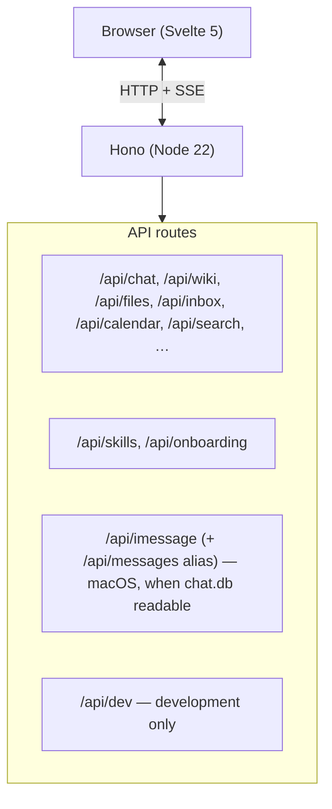

# Architecture

High-level map of **brain-app** (Hono + Svelte + pi-agent-core). Roadmap: [OPPORTUNITIES.md](./OPPORTUNITIES.md). Issues: [BUGS.md](./BUGS.md).

**Detailed decision notes and deep dives** live in [`docs/architecture/README.md`](architecture/README.md). This page stays an **index + short rationale** only.

---

## Overview

Personal assistant web app: **Chat** (agent), **Wiki** (markdown vault), **Inbox** (ripmail), served from one Node process.

Vite runs **inside** the same server in dev; production serves `dist/client`. See **[runtime and routes](architecture/runtime-and-routes.md)**.

---

## Where to read next

| Topic                                                   | Doc                                                                                                                          |
| ------------------------------------------------------- | ---------------------------------------------------------------------------------------------------------------------------- |
| HTTP routing, auth, periodic sync, native app ports     | [architecture/runtime-and-routes.md](architecture/runtime-and-routes.md)                                                     |
| Desktop vs Cloud deployment models                      | [architecture/deployment-models.md](architecture/deployment-models.md)                                                       |
| Multi-tenant cloud architecture (NAS, isolation)        | [architecture/multi-tenant-cloud-architecture.md](architecture/multi-tenant-cloud-architecture.md)                           |
| Tenant filesystem isolation (BUG-012, kernel + app)     | [architecture/tenant-filesystem-isolation.md](architecture/tenant-filesystem-isolation.md)                                   |
| Cloud-hosted v1 scope (Phase 0 parity)                  | [architecture/cloud-hosted-v1-scope.md](architecture/cloud-hosted-v1-scope.md)                                               |
| Agent sessions, chat JSON files, SSE events, tool list  | [architecture/agent-chat.md](architecture/agent-chat.md)                                                                     |
| `$BRAIN_HOME` layout, wiki vs sync no-op, calendar ICS  | [architecture/data-and-sync.md](architecture/data-and-sync.md)                                                               |
| Ripmail, unified search, files API, optional iMessage   | [architecture/integrations.md](architecture/integrations.md)                                                                 |
| Environment variables                                   | [architecture/configuration.md](architecture/configuration.md)                                                               |
| Future SQLite consolidation (not current)               | [architecture/future-durability.md](architecture/future-durability.md)                                                       |
| Wiki `read` vs `read_doc` (indexed sources)             | [architecture/wiki-read-vs-read-doc.md](architecture/wiki-read-vs-read-doc.md)                                               |
| Wiki-first memory vs managed memory (Honcho) — deferred | [architecture/wiki-vs-managed-memory-honcho.md](architecture/wiki-vs-managed-memory-honcho.md)                               |
| Ripmail crate internals                                 | [ripmail/docs/ARCHITECTURE.md](../ripmail/docs/ARCHITECTURE.md)                                                              |
| Brain network & inter-brain trust (strategy epic)       | [opportunities/OPP-042-brain-network-interbrain-trust-epic.md](opportunities/OPP-042-brain-network-interbrain-trust-epic.md) |

---

## Principles (short)

- **Single user, single process** — no separate API server; sessions are in-memory with chat history in JSON files under `$BRAIN_HOME/chats`.
- **Wiki is files** — agent tools from `@mariozechner/pi-coding-agent` are scoped to the wiki directory; brain-app does **not** auto-run git on the wiki (sync hook is a no-op for wiki).
  - **Email and index via ripmail** — subprocess CLI, `RIPMAIL_HOME` under Brain by default.
  - **UI Shell** — Svelte 5 SPA. The top-nav **Brain Hub widget** replaces legacy status bars and sync buttons, providing a single entry point to **Brain Hub** (`/hub`) for administration and system health.
  - **LLM** — `@mariozechner/pi-ai`, configured via env (see configuration doc).

---

## Deployment

**Primary release:** macOS **Braintunnel.app** (Tauri) — [OPP-007 (archived)](opportunities/archive/OPP-007-native-mac-app.md). **Hosted Linux container:** [OPP-041](opportunities/OPP-041-hosted-cloud-epic-docker-digitalocean.md); local image via `Dockerfile` + [`docker-compose.yml`](../docker-compose.yml) (`.env` → `env_file`). **DigitalOcean staging** (April 2026): [`docker-compose.do.yml`](../docker-compose.do.yml), registry image, **`https://staging.braintunnel.ai`** (TLS at edge), durable **`brain_data`** volume. Archived [OPP-013](opportunities/archive/OPP-013-docker-deployment.md) explains why Docker is not the **desktop** substitute.

---

## Product and multi-tenant notes

**Hosted multi-tenant (`BRAIN_DATA_ROOT`):** Users **sign in with Google** (`/api/oauth/google/start`). The OAuth callback provisions (or rebinds) a workspace directory and issues the same **`brain_session`** cookie + tenant registry mapping as desktop sessions — **no vault password** in MT.

See [PRODUCTIZATION.md](./PRODUCTIZATION.md).