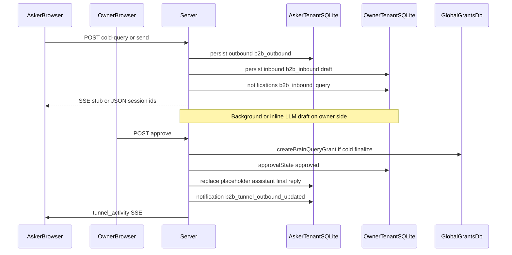

# Braintunnel B2B chat (chat-native tunnels)

**Status:** **Implemented** — cross-brain Q&A and **Tunnels** in the chat UI are **server-mediated chat sessions**, not email transport. Implementation: [`b2bChat.ts`](../../src/server/routes/b2bChat.ts) mounted at **`/api/chat/b2b`**.

**Not to confuse with:** [Cloudflare Quick Tunnel / named tunnel](../../src/server/lib/platform/tunnelManager.ts) (`BRAIN_TUNNEL_URL`) for exposing the local dev server — unrelated to B2B “Braintunnel” collaboration.

**See also:** [brain-to-brain-access-policy.md](./brain-to-brain-access-policy.md) (trust / policy model), [chat-history-sqlite.md](./chat-history-sqlite.md) (persistence + cell-scaling caveats), [`brain_query_grants`](../../src/server/lib/brainQuery/brainQueryGrantsRepo.ts) (global DB). **Tenant load balancing across containers:** [multi-container-architecture.md](./multi-container-architecture.md).

---

## Mental model

- **Single Hono process.** Each signed-in user has a **tenant** (`AsyncLocalStorage` + home dir). There is **no browser-to-browser or peer-to-peer** channel between collaborators.
- **Data placement:**
  - **Chat sessions and messages** for a workspace live in that tenant’s **`var/brain-tenant.sqlite`** ([`chatStorage.ts`](../../src/server/lib/chat/chatStorage.ts)).
  - **Grants** (`brain_query_grants`: who may query whom, policy, auto/review/ignore) live in **global** SQLite ([`brainGlobalDb.ts`](../../src/server/lib/global/brainGlobalDb.ts)).
- **Cross-tenant work:** the server **validates** the acting user, then uses **`runWithTenantContextAsync`** to open the **peer tenant’s** DB and persist inbound threads / notifications there — same pattern as described in [chat-history-sqlite — B2B cross-tenant writes](./chat-history-sqlite.md#b2b-cross-tenant-writes-and-cell-scaling).

---

## Request lifecycle (high level)

- **Cold query** (no grant yet): asker hits **`POST /api/chat/b2b/cold-query`**; server creates **paired** `b2b_outbound` (asker) and `b2b_inbound` (owner) rows linked by cold-query metadata; owner gets a **review** item; **approve** creates the real **grant** and links both sessions to it (`finalizeColdSessionWithGrant`).
- **Warm send** (grant exists): asker uses **`POST /api/chat/b2b/send`**; server creates a new **inbound** session per question on the owner; if policy is **review**, asker transcript shows a **placeholder** assistant row until owner **approves**.

---

## Session types and state

Types and fields: [`chatTypes.ts`](../../src/server/lib/chat/chatTypes.ts).

| Concept | Notes |
|--------|--------|
| `sessionType` | `own` (default chat), `b2b_outbound` (asker’s tunnel thread), `b2b_inbound` (owner’s answering-side thread). |
| `approvalState` | On inbound: `pending` / `approved` / `declined` / `auto` / `dismissed`. |
| Cold handshake | `isColdQuery`, `coldPeerUserId`, `coldLinkedSessionId` until grant is finalized; then **`remote_grant_id`** is set and cold flags cleared (`finalizeColdSessionWithGrant`). |
| Outbound placeholder | Assistant messages may set `b2bDelivery: 'awaiting_peer_review'` with copy from [`b2bTunnelDelivery.ts`](../../src/shared/b2bTunnelDelivery.ts). |

### Web UI (asker)

- **Outbound threads** are meant to be read and composed from **`/tunnels/:handle`** ([`TunnelDetail.svelte`](../../src/client/components/TunnelDetail.svelte)): unified timeline + `POST /api/chat/b2b/send`, with the **response body SSE** (`text_delta` / `done`) driving immediate assistant text in-pane (no main-chat tool transcript).
- The primary **`/c` AgentChat** surface does **not** host `b2b_outbound` sessions; opening one redirects to Tunnels for the peer **handle**. **`tunnel_activity`** / notifications still nudge clients to **refetch the timeline** when the peer or server updates state.

---

## HTTP API (`/api/chat/b2b`)

Mounted in [`registerApiRoutes.ts`](../../src/server/registerApiRoutes.ts). Methods below are **relative to** `/api/chat/b2b`.

| Route | Role |
|-------|------|
| `POST /cold-query` | First contact: resolve target handle/email/id; create paired cold sessions; notify owner; return outbound `sessionId`. |
| `POST /send` | Send on an **existing grant**; create inbound thread; auto vs review per grant policy. |
| `POST /approve` | Owner releases draft (cold or warm); may **`createBrainQueryGrant`** on cold approve; pushes final text to asker outbound. |
| `POST /decline` | Owner declines; asker may get a standard decline message. |
| `POST /dismiss` | Owner dismisses pending inbound without sending. |
| `POST /regenerate` | Owner asks for a new draft (pending only). |
| `GET /review` | List inbound review rows for UI (pending/sent/all). **Wire path:** `GET /api/chat/b2b/review` — not a browser page route. |
| `GET /tunnels` | Asker: list grants + outbound session ids for sidebar. |
| `POST /ensure-session` | Ensure outbound stub exists for a grant. |
| `POST /withdraw-as-asker` | Revoke / tear down outbound (and cold pair if applicable). |
| `GET /inbound-session/:grantId` | Resolve chat-native inbound session for grant (owner). |
| `PATCH /grants/:grantId` | Owner policy `auto` / `review` / `ignore` (batch effects on pending). |
| `PATCH /grants/:grantId/auto-send` | Toggle auto-send shorthand. |

Grants CRUD for Hub remains under **`/api/brain-query/grants`** (see [brain-query-delegation.md](./brain-query-delegation.md)).

---

## Realtime and notifications

- **SSE:** [`notifyBrainTunnelActivity`](../../src/server/lib/hub/hubSseBroker.ts) emits event **`tunnel_activity`** on `/api/events` so clients refresh tunnel rail / review UI.
- **Notification kinds** (tenant `notifications` table) include e.g. **`b2b_inbound_query`**, **`b2b_tunnel_outbound_updated`** — presentation: [`presentation.ts`](../../src/shared/notifications/presentation.ts).

---

## Owner-side agent and privacy

Restricted toolset and two-pass **research + filter** for answers: [`b2bAgent.ts`](../../src/server/agent/b2bAgent.ts). The **research** prompt drafts from tools without embedding the grant policy; **policy text on the grant feeds the filter pass only** ([brain-to-brain-access-policy.md](./brain-to-brain-access-policy.md)).

---

## Horizontal scaling caveat

Today’s design assumes **both tenants’ homes are reachable from the same Node process** for a single request’s write chain. Hosted **cell** layouts may require **internal routing** to the peer cell — see [chat-history-sqlite — B2B cross-tenant writes and cell scaling](./chat-history-sqlite.md#b2b-cross-tenant-writes-and-cell-scaling).

---

## Verification

- **E2E (Playwright):** [`tests/e2e/b2b-sharing.spec.ts`](../../tests/e2e/b2b-sharing.spec.ts) — cold query → approve → asker sees reply.
- **HTTP / logic (Vitest):** [`b2bChat.test.ts`](../../src/server/routes/b2bChat.test.ts).

---

*Back: [architecture README](./README.md)*
