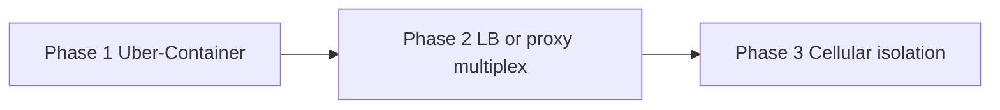

# Multi-Tenant Cloud Architecture

**Status:** Implementation Strategy — April 2026

## Overview

To support a cloud-hosted version of Brain, we will adopt a **Cell-based, Local-First** architecture. Instead of moving to a traditional centralized database (Postgres/RDS), we will maintain the "One Tenant = One Home Directory" model used on the desktop, but scaled horizontally in a cloud environment. On disk, each tenant is a **workspace handle** (a short URL-safe name) under `BRAIN_DATA_ROOT`, not an opaque UUID.

### Bootstrap identity (hosted)

Hosted cells use **Google OAuth** as the tenant gate: **`openid`** + **`email`** scopes yield a stable **`sub`** and mailbox address. The server maps **`google:`** to **workspace handle** in **`$BRAIN_DATA_ROOT/.global/tenant-registry.json`** (alongside **`brain_session` → handle** entries). Workspace directory names are **derived** from the mailbox (slug rules + collision suffixes), not typed by users. Desktop single-tenant mode is unchanged (local vault password + verifier file).

See [google-oauth.md](../google-oauth.md#multi-tenant-hosted-brain_data_root).

## Core Principles

1. **One Tenant, One Home:** Every user (tenant) has a dedicated `$BRAIN_HOME` directory.
2. **Decoupled Storage:** We use **Network-Attached Block Storage** (e.g., AWS EBS, GCP Persistent Disk) to hold tenant data, ensuring it survives container restarts or host failures.
3. **No Container-Level Resiliency:** We do not attempt to replicate live state across multiple containers for a single tenant. A specific tenant maps to a specific container instance at any given time.
4. **Uber-Container Scaling:** Initially, a single "Uber-Container" will host multiple tenants. As we scale, we will move to a "One Pod per Tenant" or "One Container per N Tenants" model.

## Storage Strategy: Network-Attached Storage (NAS)

We leverage the OS Page Cache and modern cloud block storage to provide a high-performance experience without the complexity of a distributed database.

### Performance & Caching

- **Reads:** The Linux kernel's **Page Cache** will naturally bring "hot" SQLite pages and Wiki files into the container's RAM. For active users, read latency will be near-local (nanoseconds/microseconds).
- **Writes:** Background sync (Ripmail) is the primary source of writes. Network latency (milliseconds) is acceptable for these background tasks.
- **SQLite WAL Mode:** We use Write-Ahead Logging to ensure that background sync writes do not block foreground user reads.

### Resiliency & Backups

- **Volume Snapshots:** We rely on cloud-provider-level snapshots of the block storage for disaster recovery. These are crash-consistent and extremely efficient.
- **Total Loss Recovery:** If a node or container is lost, the orchestrator simply attaches the tenant's persistent volume to a new container.
- **Off-site Insurance:** For "Region-Down" scenarios, we use tools like **Litestream** (for SQLite) or **S3 Sync** (for files) to stream deltas to a different geographic region.

## Tenant Isolation & Security Guardrails

**Deeper FS / agent isolation strategies** (micro-VM, POSIX UID, Landlock, directory FDs, `Workspace` jail) and the link to the open critical path-sandbox bug are in **[tenant-filesystem-isolation.md](./tenant-filesystem-isolation.md)** ([BUG-012](../bugs/BUG-012-agent-tool-path-sandbox-escape.md)).

While **hosted multi-tenant** mode does **not** use the desktop **vault password** verifier (authentication is **Google OAuth + session cookie**), we still enforce tenant isolation through "Defense in Depth" guardrails:

1. **Zero Ambient Authority:** Move away from environment variables (like `BRAIN_HOME` or `RIPMAIL_HOME`). The application must crash if a home directory is not explicitly provided via a request-specific context object.
2. **Explicit CLI Arguments:** Subprocesses like `ripmail` must receive their home directory via mandatory CLI flags (e.g., `--home`) rather than inheriting environment variables, preventing accidental leakage.
3. **Path Sandboxing (Jailing):** Every tool entry point must use a mandatory `resolve + relative` check. Any path from an Agent (untrusted input) that attempts to escape the tenant's home directory via `..` traversal must be blocked at the common code layer.
4. **Async Context Isolation:** Use `AsyncLocalStorage` to ensure that tenant-specific metadata (ID, home path) is tethered to the asynchronous execution flow of a request, preventing race conditions from swapping tenant state.
5. **Cloud Encryption at Rest:** Leveraging provider-native encryption for all block storage volumes.

## Scaling Roadmap

- **Phase 1 (The Uber-Container):** A single Node.js process managing multiple tenant instances in-memory. Suitable for the first ~100-500 users.
- **Phase 2 (Multiplexing):** A lightweight routing layer (Load Balancer / Proxy) that routes requests to specific containers based on a `tenant_id` in the URL or Header.
- **Phase 3 (Cellular Isolation):** Moving to dedicated micro-containers or pods for high-value or high-usage tenants.

Block storage survives container replacement: attach the same tenant volume to a new container after node loss (see **Resiliency & Backups** above).

## Rationale: Why not a Remote Database?

Moving `ripmail` or the Wiki to a remote database (Postgres/S3) would introduce:

- **Network Latency:** Every query would incur a round-trip, killing the "instant" feel of the UI.
- **Architectural Complexity:** We would lose the simplicity of the local-first codebase.
- **Migration Risk:** Managing a single massive schema for all users is a significant operational burden compared to thousands of independent, small SQLite files.

