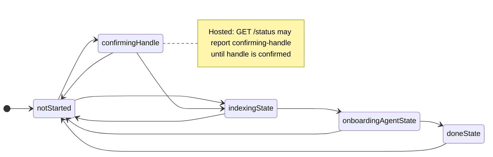

# Onboarding flow and persisted state machine

**Single source of truth** for persisted onboarding states, allowed transitions, and how first-time mail sync is kicked and gated before the guided interview.

**Related (product / opportunity docs — not duplicated here):**

- Interview UX / agent phases → [OPP-054: Guided onboarding agent](../opportunities/OPP-054-guided-onboarding-agent.md) (product intent; some phases deferred).  
- Why mail uses a phased **backfill** window (30d then 1y) → [OPP-093](../opportunities/OPP-093-phased-onboarding-sync.md) (problem + risks; implementation summary points here).

**Related (engineering docs):**

- `$BRAIN_HOME` layout and **`onboarding.json`** on disk → [data-and-sync.md](./data-and-sync.md)  
- Ripmail subprocess contract (**`RIPMAIL_HOME`**, tooling) → [integrations.md](./integrations.md)  
- **Refresh vs backfill** locks and behavior in ripmail → [ripmail SYNC.md](../../ripmail/docs/SYNC.md) (`sync_summary` lanes; concurrent refresh + backfill)  
- SPA routes (**`/welcome`**, `/onboarding`), `/api/oauth/google/*`, vault bootstrap → [runtime-and-routes.md](./runtime-and-routes.md)  
- Gmail OAuth redirects, Tauri browser flow → [google-oauth.md](../google-oauth.md)  
- Hosted tenancy and handle confirmation → [multi-tenant-cloud-architecture.md](./multi-tenant-cloud-architecture.md)  
- Index of all architecture topics → [ARCHITECTURE.md](../ARCHITECTURE.md)

**Code:**

- Persisted states: [`src/server/lib/onboarding/onboardingState.ts`](../../src/server/lib/onboarding/onboardingState.ts)  
- Routes: [`src/server/routes/onboarding.ts`](../../src/server/routes/onboarding.ts)  
- Phase-1 sync helper: [`src/server/lib/platform/syncAll.ts`](../../src/server/lib/platform/syncAll.ts) (`syncInboxRipmailOnboarding` → `ripmail backfill 30d`)  
- POST `/api/inbox/sync` dispatch: [`src/server/routes/inbox.ts`](../../src/server/routes/inbox.ts)  
- Mail polling payload / ripmail JSON parse: [`src/server/lib/onboarding/onboardingMailStatus.ts`](../../src/server/lib/onboarding/onboardingMailStatus.ts), [`src/server/lib/ripmail/ripmailStatusParse.ts`](../../src/server/lib/ripmail/ripmailStatusParse.ts) (`refreshRunning` vs `backfillRunning`)  
- Client: [`src/client/components/onboarding/Onboarding.svelte`](../../src/client/components/onboarding/Onboarding.svelte)  
- Thresholds / PATCH error code: [`src/shared/onboardingProfileThresholds.ts`](../../src/shared/onboardingProfileThresholds.ts) (`ONBOARDING_PROFILE_INDEX_MANUAL_MIN`, `ONBOARDING_BACKFILL_STILL_RUNNING_CODE`)

HTTP surface summary: [`runtime-and-routes.md`](runtime-and-routes.md) (`/api/onboarding/*`). Component tests involving onboarding UI: [component-testing.md](../component-testing.md).

---

## Persisted states (onboarding machine)

Stored in **`onboarding.json`** at the root of the tenant **chats** directory (`chatDataDir()` in `chatStorage.ts` / `brainLayoutChatsDir`), alongside chat session files — **not** under `var/`. Adjunct onboarding metadata (e.g. wiki buildout first-run flag) uses **`chats/onboarding/`** via `onboardingDataDir()` in `onboardingState.ts`. Type **`OnboardingMachineState`**:

| State | Meaning |
| ----- | ------- |
| `not-started` | First-run UX; mail may or may not be configured yet. |
| `confirming-handle` | **Hosted synthetic gate** — reported by **GET `/api/onboarding/status`** until the tenant’s Brain handle is confirmed; may not appear on disk alone. |
| `indexing` | “Getting to Know You”: first mail corpus building; user sees indexing hero; server/client gate advancement to interview. |
| `onboarding-agent` | Guided onboarding interview (SSE agent); **`wiki/me.md`** authoring policy per OPP-054. |
| `done` | Onboarding finished; Hub/inbox handles ongoing mail sync (not onboarding state). |

Legacy disk values **`profiling`**, **`reviewing-profile`**, **`seeding`** are **read-normalized** to `onboarding-agent` / `done` (`readOnboardingStateDoc`).

---

## Allowed transitions

Table form (canonical `canTransition` in `onboardingState.ts`):

| From → To | Allowed next states |
|-----------|---------------------|
| `not-started` | `confirming-handle`, `indexing`, `not-started` (no-op / idempotent rewrite) |
| `confirming-handle` | `not-started`, `indexing` |
| `indexing` | `onboarding-agent`, `not-started` |
| `onboarding-agent` | `done`, `not-started` |
| `done` | `not-started` |

**PATCH `/api/onboarding/state`** applies `setOnboardingState` and enforces this graph (plus extra guards — handle confirmation in MT, mail thresholds when leaving `indexing`, etc. in `onboarding.ts`).

---

## End-to-end flow (high level)

1. **Vault / sign-in** — User unlocks or signs in; tenant context exists.  
2. **Mail setup** — Apple or Google path completes; ripmail `config.json` exists under tenant `ripmail/` home.  
3. **Enter `indexing`** — Client PATCHes `indexing` when appropriate; **POST `/api/inbox/sync`** is kicked (see below).  
4. **Phase 1 mail (OPP-093)** — While onboarding dispatch applies, sync runs **`ripmail backfill 30d`** in the **background** (detached); the UI **polls** GET `/api/onboarding/mail` (→ `getOnboardingMailStatus` / `ripmail status --json`).  
5. **Advance to `onboarding-agent`** — When **indexed count ≥** `ONBOARDING_PROFILE_INDEX_MANUAL_MIN` **and** ripmail reports **`backfillRunning === false`** (backfill lane idle), client auto-PATCHes (or user retries). Server rechecks count and **rejects** if backfill still running (`code: onboarding_backfill_running`).  
6. **Phase 2 mail** — On transition **`indexing` → `onboarding-agent`**, server starts **`ripmail backfill 1y`** in the **background** (idempotent fill of older mail vs phase 1).  
7. **Interview + finalize** — OPP-054; then **`done`**.

After **`done`**, **`PATCH` does not** move users back through onboarding for “add another mailbox” — that is Hub/inbox.

---

## Mail: refresh lane vs backfill lane

Ripmail status JSON exposes **two independent lanes** (see `ripmailStatusParse.ts`):

- **`refreshRunning`** — `ripmail refresh` work (`syncInboxRipmail`, Hub sync, supervisor refresh kicks, etc.).  
- **`backfillRunning`** — `ripmail backfill …` work (onboarding **30d** and **1y**).

Onboarding **phase 1** intentionally starts **backfill 30d**, not a full default-window **refresh**, to avoid a huge first IMAP search (OPP-093). **Refresh can still be true** during indexing if another part of the app kicks `ripmail refresh`, or if ripmail reports both lanes; gating **advance to `onboarding-agent`** uses **`backfillRunning`**, not “any sync”.

---

## Key API behaviors

| Route | Role |
| ----- | ---- |
| **GET `/api/onboarding/status`** | Persisted `state` + `wikiMeExists`; may override to `confirming-handle` when hosted handle not confirmed. |
| **PATCH `/api/onboarding/state`** | Validates transition; **`indexing` → `onboarding-agent`**: min indexed messages + **`!mail.backfillRunning`**; on success kicks **backfill 1y**; optional error **`code`** for backfill-busy rejection. |
| **GET `/api/onboarding/mail`** | Lightweight poll: `indexedTotal`, `ftsReady`, **`backfillRunning`**, `syncRunning`, hints, etc. |
| **POST `/api/inbox/sync`** | If onboarding state implies first-pass indexing, **`syncInboxRipmailOnboarding`** (else normal inbox refresh). |

---

## Hosted vs desktop

**`confirming-handle`** is primarily a **reported** state for UX until `/api/onboarding/confirm-handle` completes; persisted transitions still follow the table once handle is satisfied.

See also: [multi-tenant cloud architecture](./multi-tenant-cloud-architecture.md), [vault session / runtime routing](./runtime-and-routes.md).
