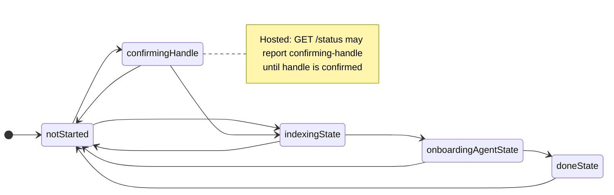

# Onboarding flow and persisted state machine

**Single source of truth** for persisted onboarding states, allowed transitions, and how first-time mail sync is kicked and gated before the guided interview.

**Related (product / opportunity docs — not duplicated here):**

- **Holistic onboarding orchestration** (email + interview + wiki coordination, unified Hub status) → [OPP-094 (archived)](../opportunities/archive/OPP-094-holistic-onboarding-background-task-orchestration.md) · [stub](../opportunities/OPP-094-holistic-onboarding-background-task-orchestration.md); engineering notes → [background-task-orchestration.md](./background-task-orchestration.md)
- Interview UX / agent phases → **[archived OPP-054](../opportunities/archive/OPP-054-guided-onboarding-agent.md)** · [stub](../opportunities/OPP-054-guided-onboarding-agent.md) (product intent; some phases deferred)
- Historical rationale for a **bounded first pass** (avoid huge default refresh) → [OPP-093 (archived)](../opportunities/archive/OPP-093-phased-onboarding-sync.md) (problem + risks; current ship uses a single **~1y** slice from indexing — see flow below)

**Related (engineering docs):**

- `$BRAIN_HOME` layout and **`onboarding.json`** on disk → [data-and-sync.md](./data-and-sync.md)  
- Ripmail **home layout** (tenant `ripmail/`) → [integrations.md](./integrations.md)  
- **Refresh vs backfill** locks and behavior (Rust-era detail) → [ripmail-rust-snapshot.md](./ripmail-rust-snapshot.md) (`ripmail/docs/SYNC.md` on the tagged revision; `sync_summary` lanes)  
- SPA routes (**`/welcome`**, `/onboarding`), `/api/oauth/google/*`, vault bootstrap → [runtime-and-routes.md](./runtime-and-routes.md)  
- Gmail OAuth redirects, Tauri browser flow → [google-oauth.md](../google-oauth.md)  
- Hosted tenancy and handle confirmation → [multi-tenant-cloud-architecture.md](./multi-tenant-cloud-architecture.md)  
- Index of all architecture topics → [ARCHITECTURE.md](../ARCHITECTURE.md)

**Code:**

- Persisted states: [`src/server/lib/onboarding/onboardingState.ts`](../../src/server/lib/onboarding/onboardingState.ts)  
- Routes: [`src/server/routes/onboarding.ts`](../../src/server/routes/onboarding.ts)  
- Initial onboarding sync helper: [`src/server/lib/platform/syncAll.ts`](../../src/server/lib/platform/syncAll.ts) (`syncInboxRipmailOnboarding` → TS `refresh` with **`historicalSince: '1y'`** for Gmail historical pagination)  
- POST `/api/inbox/sync` dispatch: [`src/server/routes/inbox.ts`](../../src/server/routes/inbox.ts)  
- Mail polling payload / in-process status: [`src/server/lib/onboarding/onboardingMailStatus.ts`](../../src/server/lib/onboarding/onboardingMailStatus.ts) (`ripmailStatusParsed`), [`src/server/ripmail/status.ts`](../../src/server/ripmail/status.ts) (`statusParsed`), [`src/server/lib/ripmail/ripmailStatusParse.ts`](../../src/server/lib/ripmail/ripmailStatusParse.ts) (CLI JSON shape / fixtures — `refreshRunning` vs `backfillRunning`)  
- Client first-run mail UX: [`src/client/components/onboarding/OnboardingFirstRunPanel.svelte`](../../src/client/components/onboarding/OnboardingFirstRunPanel.svelte) (Brain Hub Activity)  
- Thresholds: [`src/shared/onboardingProfileThresholds.ts`](../../src/shared/onboardingProfileThresholds.ts) (`ONBOARDING_PROFILE_INDEX_MANUAL_MIN` **500**, `WIKI_BUILDOUT_MIN_MESSAGES` **1000**; legacy constant **`ONBOARDING_BACKFILL_STILL_RUNNING_CODE`** retained only for stale references)
- Small-inbox auto-advance gate: [`src/shared/onboardingMailGate.ts`](../../src/shared/onboardingMailGate.ts) (`isOnboardingInitialMailSyncComplete`, `canAdvanceToOnboardingAgent`)
- Unified Hub status: [`GET /api/background-status`](./background-task-orchestration.md)

HTTP surface summary: [`runtime-and-routes.md`](runtime-and-routes.md) (`/api/onboarding/*`). Component tests involving onboarding UI: [component-testing.md](../component-testing.md).

---

## Persisted states (onboarding machine)

Stored in **`onboarding.json`** at the root of the tenant **chats** directory (`chatDataDir()` in [`chatStorage.ts`](../../src/server/lib/chat/chatStorage.ts) / `brainLayoutChatsDir`). **Chat session transcripts** live in **`var/brain-tenant.sqlite`**, not under `chats/`. Adjunct onboarding metadata (e.g. wiki buildout first-run flag, **`wiki-bootstrap.json`** for [OPP-095](../opportunities/OPP-095-wiki-first-draft-bootstrap.md)) uses **`chats/onboarding/`** via `onboardingDataDir()` in `onboardingState.ts`. Type **`OnboardingMachineState`**:

| State | Meaning |
| ----- | ------- |
| `not-started` | First-run UX; mail may or may not be configured yet. |
| `confirming-handle` | **Hosted synthetic gate** — reported by **GET `/api/onboarding/status`** until the tenant’s Brain handle is confirmed; may not appear on disk alone. |
| `indexing` | “Getting to Know You”: first mail corpus building; user sees indexing hero; server/client gate advancement to interview. |
| `onboarding-agent` | Guided **initial bootstrap** in the **main Assistant chat** (`POST /api/chat` with merged onboarding + first-impression prompts while this state is active); **`wiki/me.md`** authoring policy per OPP-054. |
| `done` | Onboarding finished; Hub/inbox handles ongoing mail sync (not onboarding state). |

Legacy disk values **`profiling`**, **`reviewing-profile`**, **`seeding`** are **read-normalized** to `onboarding-agent` / `done` (`readOnboardingStateDoc`).

---

## Allowed transitions

Table form (canonical `canTransition` in `onboardingState.ts`):

| From → To | Allowed next states |
|-----------|---------------------|
| `not-started` | `confirming-handle`, `indexing`, `not-started` (no-op / idempotent rewrite) |
| `confirming-handle` | `not-started`, `indexing` |
| `indexing` | `onboarding-agent`, `not-started` |
| `onboarding-agent` | `done`, `not-started` |
| `done` | `not-started` |

**PATCH `/api/onboarding/state`** applies `setOnboardingState` and enforces this graph (plus extra guards — handle confirmation in MT, mail thresholds when leaving `indexing`, etc. in `onboarding.ts`).

---

## End-to-end flow (high level)

1. **Vault / sign-in** — User unlocks or signs in; tenant context exists.  
2. **Mail setup** — Apple or Google path completes; ripmail `config.json` exists under tenant `ripmail/` home.  
3. **Enter `indexing`** — Client PATCHes `indexing` when appropriate; **POST `/api/inbox/sync`** is kicked (see below).  
4. **Initial mail (~1 year)** — While onboarding dispatch applies, **`syncInboxRipmailOnboarding`** runs **`refresh` with `historicalSince: '1y'`** in the **background** (single slice for new accounts — no separate “30d then extend” chain). The UI **polls** GET `/api/onboarding/mail` (→ **`getOnboardingMailStatus`** → in-process **`ripmailStatusParsed`** / SQLite).  
5. **Advance to `onboarding-agent`** — As soon as gates pass; the ~1y lane may still be running:
   - **Threshold path:** indexed count **≥** `ONBOARDING_PROFILE_INDEX_MANUAL_MIN` (**500**). Client auto-PATCHes (or user retries). Server rechecks the same threshold; it does **not** wait for `backfillRunning === false`. The historical job keeps running to completion; advancing to interview does **not** cancel it.
   - **Small-inbox path:** indexed count is below **500** **but** the initial mail sync has fully drained — `configured && lastSyncedAt && !syncRunning && !backfillRunning && !refreshRunning && !pendingBackfill && !staleMailSyncLock && !indexingHint` (see `isOnboardingInitialMailSyncComplete`). Without this, brand‑new accounts with only a handful of messages would be stuck on the indexing hero forever (e.g. "37 / 500" with nothing more to fetch). Both client auto-advance and server PATCH gate accept this case.
6. **No second enqueue on transition** — **`PATCH` `indexing` → `onboarding-agent`** does **not** start another historical pull; one ~1y job was already queued from indexing.  
7. **Interview + finalize** — While state is **`onboarding-agent`**, the client kicks a single **initial bootstrap** stream on **`POST /api/chat`** (merged prompts + mail-index facts). **`POST /finalize`** / **`PATCH` → `done`** runs after `finish_conversation` (or Skip setup); there is **no** separate server “first chat pending” hop.  
8. **Wiki first-draft bootstrap + Your Wiki supervisor** — When indexed ≥ **`WIKI_BUILDOUT_MIN_MESSAGES`** (**1000**) **and** mail is configured, **`kickWikiSupervisorIfIndexedGatePasses`** runs on **`GET /api/onboarding/mail`** and **`GET /api/background-status`** (often **during** indexing or interview — **before** finalize). **`notifyOnboardingInterviewDone`** also invokes it after finalize (**idempotent**). See **[OPP-095](../opportunities/OPP-095-wiki-first-draft-bootstrap.md)**:
   - **First:** a **one-shot bootstrap agent** may **`write`** bounded `people/` / `projects/` / `topics/` / `travel/` stubs (persisted completion in **`chats/onboarding/wiki-bootstrap.json`**).
   - **Then:** the continuous **Your Wiki** supervisor (`ensureYourWikiRunning`) runs enrich → cleanup laps (**deepen-only** steady state per archived OPP-067).

### Milestones (OPP-094 / OPP-095)

| Milestone | Meaning (approximate) |
|-----------|------------------------|
| **Interview-ready** | Enough indexed mail (**≥ 500**) **and** mailbox configured (`GET /api/background-status` → `onboarding.milestones.interviewReady`). The initial ~1y historical lane (`backfillRunning`) may still be running. |
| **Wiki-ready** | Onboarding **`done`** **and** indexed ≥ **1000** **and** wiki bootstrap finished (**`completed`** or **`failed`** on disk — maintenance can start). |
| **Fully synced** | **`done`** and ripmail mail lanes quiet (`milestones.fullySynced` — heuristic for “initial heavy lifting idle”). |

After **`done`**, **`PATCH` does not** move users back through onboarding for “add another mailbox” — that is Hub/inbox.

---

## Mail: refresh lane vs backfill lane

Ripmail status JSON exposes **two independent lanes** (see `ripmailStatusParse.ts`):

- **`refreshRunning`** — incremental `refresh` work without a bounded historical slice (`syncInboxRipmail`, Hub sync, etc.).  
- **`backfillRunning`** — bounded historical work: TS **`refresh(…, { historicalSince })`** (onboarding’s ~1y Gmail slice uses this lane — see `src/server/ripmail/sync/index.ts`). Legacy Rust CLI had a separate `backfill` subcommand; semantics map to the same lane in status JSON.

Onboarding starts one **`historicalSince: '1y'`** job during indexing (bounded pull, not an unbounded default-window refresh). **Refresh can still be true** during indexing if another part of the app kicks a plain `refresh`, or if ripmail reports both lanes. **Advance to `onboarding-agent`** is gated on **indexed count** (and configured mail), **not** on backfill lane idle.

---

## Key API behaviors

| Route | Role |
| ----- | ---- |
| **GET `/api/onboarding/status`** | Persisted `state` + `wikiMeExists`; may override to `confirming-handle` when hosted handle not confirmed. |
| **PATCH `/api/onboarding/state`** | Validates transition; **`indexing` → `onboarding-agent`**: min indexed messages **or** small-inbox initial-sync-complete (see step 5 / `canAdvanceToOnboardingAgent`). Does **not** enqueue additional historical sync on success (initial ~1y already running from indexing). |
| **GET `/api/onboarding/mail`** | Lightweight poll: `indexedTotal`, `ftsReady`, **`backfillRunning`**, `syncRunning`, hints, etc. (in-process ripmail DB — see `getOnboardingMailStatus`). |
| **POST `/api/inbox/sync`** | If onboarding state implies first-pass indexing, **`syncInboxRipmailOnboarding`** (else normal inbox refresh). |

---

## Hosted vs desktop

**`confirming-handle`** is primarily a **reported** state for UX until `/api/onboarding/confirm-handle` completes; persisted transitions still follow the table once handle is satisfied.

See also: [multi-tenant cloud architecture](./multi-tenant-cloud-architecture.md), [vault session / runtime routing](./runtime-and-routes.md).
