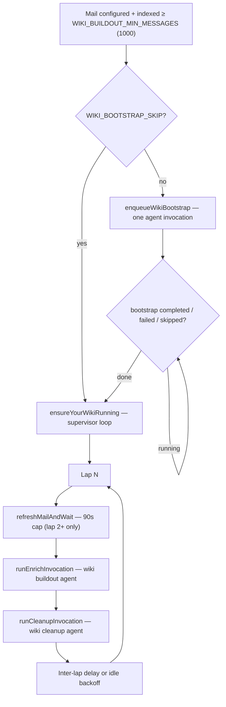

# Your Wiki background pipeline

**Canonical architecture** for automated wiki building after onboarding: **first-draft bootstrap** (optional one-shot), then the **Your Wiki supervisor** (continuous **enrich → cleanup** laps).

**Related (narrower scopes):**

- **[background-task-orchestration.md](./background-task-orchestration.md)** — `GET /api/background-status`, indexed gate kick, orchestrator failures, troubleshooting index
- **[background-sync-and-supervisor-scaling.md](./background-sync-and-supervisor-scaling.md)** — mail refresh triggers, one supervisor loop per Node process, multi-tenant scaling caveats
- **[onboarding-state-machine.md](./onboarding-state-machine.md)** — when the wiki kick runs relative to interview / `done`
- **Product / vision:** [OPP-033](../opportunities/OPP-033-wiki-compounding-karpathy-alignment.md) (Karpathy alignment, Hub copy), [archived OPP-095](../opportunities/archive/OPP-095-wiki-first-draft-bootstrap.md) (bootstrap budgets)

---

## TL;DR

| Phase | Agent | May create new pages? | When |
|-------|--------|----------------------|------|
| **Bootstrap** | `wiki-bootstrap` | **Yes** — bounded `write` under typed folders | Once, after indexed mail ≥ **1000**, before supervisor |
| **Enrich** (per lap) | `wiki-buildout` | **No** — `edit` only (`write` blocked for new paths) | Every supervisor lap |
| **Cleanup** (per lap) | `wiki-cleanup` | **No** — `edit` only | Immediately after enrich in the same lap |

**One lap** = optional pre-lap mail refresh (lap 2+) → **enrich** → **cleanup** → backoff or idle.

---

## End-to-end flow

### Indexed gate and kick sites

[`kickWikiSupervisorIfIndexedGatePasses`](../../src/server/lib/backgroundTasks/wikiKickAfterOnboardingDone.ts) runs when:

- Mail is **configured**
- Indexed count ≥ **`WIKI_BUILDOUT_MIN_MESSAGES`** (**1000**, [`onboardingProfileThresholds.ts`](../../src/shared/onboardingProfileThresholds.ts))

Triggered from **`GET /api/onboarding/mail`**, **`GET /api/background-status`**, and **`notifyOnboardingInterviewDone`** (idempotent).

While bootstrap **`status === 'running'`**, the supervisor **does not** start.

---

## Persistence and observability

| Artifact | Path / id | Role |
|----------|-----------|------|
| Supervisor run doc | `background/runs/your-wiki.json` — id **`your-wiki`** | `phase`, `lap`, `consecutiveNoOpLaps`, `lapMailSyncIncomplete`, timeline, usage |
| Pause state | `$BRAIN_HOME/your-wiki/state.json` | `{ "paused": true \| false }` — survives restart |
| Bootstrap state | `chats/onboarding/wiki-bootstrap.json` | `not-started` \| `running` \| `completed` \| `failed` \| `skipped` |
| Edit log | `var/wiki-edits.jsonl` | Append-only paths for chat + agent writes — feeds enrich queue |
| Buildout first-run flag | `chats/onboarding/` (via `onboardingState.ts`) | First lap uses starter-layout scope in buildout system prompt |

Hub reads **`GET /api/background-status`** (wiki slice includes **`bootstrap`**) and **`GET /api/events`** SSE (`your_wiki`) for live updates.

---

## Phase 1: Wiki bootstrap (not a lap)

**Modules:** [`wikiBootstrapRunner.ts`](../../src/server/agent/wikiBootstrapRunner.ts), [`wikiBootstrapAgent.ts`](../../src/server/agent/wikiBootstrapAgent.ts), prompt [`wiki-bootstrap/system.hbs`](../../src/server/prompts/wiki-bootstrap/system.hbs).

**Goal:** Create a **bounded first draft** from indexed mail (and optional calendar block in injected context) so steady-state laps have real pages to deepen.

**Hard budgets** ([`wikiBootstrap.ts`](../../src/shared/wikiBootstrap.ts)):

| Category | Max new pages |
|----------|----------------|
| `people/*.md` | **16** |
| `projects/*.md` + `topics/*.md` combined | **8** |
| `travel/` artifacts | **2** |

**Tools:** `write` allowed for new entity paths under typed folders; `edit` for `index.md` / light `me.md` touch-ups; mail + optional `calendar`, `web_search`, `fetch_page`.

**Skip:** `WIKI_BOOTSTRAP_SKIP=true` marks bootstrap **`skipped`** and starts the supervisor without running the agent.

---

## Phase 2: Your Wiki supervisor

**Module:** [`yourWikiSupervisor.ts`](../../src/server/agent/yourWikiSupervisor.ts).

**Design (OPP-033):**

- **One in-process loop** per Node process — no cron
- **Pause** aborts the current enrich or cleanup invocation; disk state is whatever was written so far
- **Resume** always starts a **new lap at enriching** — never mid-stream continuation of the interrupted agent session
- **Idle** after **3** consecutive no-op laps; wake via `requestLapNow()`, resume, or max backoff timeout

### Supervisor constants

| Constant | Value | Meaning |
|----------|-------|---------|
| `INTER_LAP_DELAY_MS` | 5s | Delay after a lap that produced edits |
| `NO_OP_BACKOFF_MS` | 2m, 10m, 30m | Backoff after 1–3 no-op laps |
| `IDLE_AFTER_NO_OP_LAPS` | 3 | Enter idle; wait up to 30m (last backoff step) |
| `MAX_SUPERVISOR_AUTO_RESTARTS` | 3 | Outer-loop crash auto-restart per streak |
| Pre-lap mail refresh timeout | 90s | `refreshMailAndWait` in supervisor |

### User-visible phases

| `phase` | Hub copy direction |
|---------|-------------------|
| `starting` | **Starting your first pages** (lap 1 while doc was `starting`) |
| `enriching` | **Enriching · Lap N** |
| `cleaning` | **Cleaning up · Lap N** |
| `paused` | **Paused** |
| `idle` | **Up to date** / waiting for mail or nudge |
| `error` | Error detail from outer-loop failure |

---

## What is in a lap?

Each iteration of `supervisorLoop`:

1. **`lap++`**, set phase to `starting` (lap 1 only) or `enriching`
2. **Pre-lap mail sync** — skipped on **lap 1** (onboarding already indexed mail); lap 2+ runs `refreshMailAndWait(90_000)` and builds a minimal **`syncNote`** (no recent-message listing — avoids recency bias)
3. **`runEnrichInvocation`** — single buildout agent `agent.prompt(...)` then session teardown
4. **`runCleanupInvocation`** — single cleanup agent `agent.prompt(...)` then session teardown
5. **No-op tracking** — `enrich.changeCount + cleanup.editCount`; backoff or idle

**Not in a lap:** bootstrap, chat turns (chat may `write` new pages anytime; enrich deepens on later laps via queue + `wiki-edits.jsonl`).

---

## Enrich step (buildout / deepen)

**Modules:** [`wikiExpansionRunner.ts`](../../src/server/agent/wikiExpansionRunner.ts) (`runEnrichInvocation`), [`wikiBuildoutAgent.ts`](../../src/server/agent/wikiBuildoutAgent.ts), [`wiki-buildout/system.hbs`](../../src/server/prompts/wiki-buildout/system.hbs).

**Session id:** `wiki-buildout-your-wiki` (deleted after each invocation).

### Injected context (`buildExpansionContextPrefix`)

Built server-side and prepended to the user message (do not rely on the model to `read` `me.md` / `assistant.md` via tools):

| Section | Source | Limit |
|---------|--------|-------|
| Profile | `me.md` | full file |
| Assistant charter | `assistant.md` | full file |
| Recent wiki edits | `wiki-edits.jsonl` tail | **35** paths (`WIKI_DEEPEN_RECENT_EDITS_LIMIT`) |
| Thin pages | Heuristic under `people/`, `projects/`, `topics/` | &lt;120 words, or `## Chat capture` + &lt;200 words |
| **Deepen this lap (priority)** | Merge recent + thin | **30** paths (`WIKI_DEEPEN_WORK_QUEUE_CAP`) |
| Vault manifest | `listWikiFiles` | all paths |
| Data freshness | `syncNote` when lap 2+ mail refresh ran | prose only |

If the priority queue is empty, the prefix tells the agent to **idle** — no speculative inbox-wide entity discovery.

### Agent instructions (summary)

**System prompt:** Deepen **existing** pages only; **`edit`** for vault markdown; **`write`** must not create new paths (enforced in [`wikiScopedFsTools`](../../src/server/agent/tools/wikiScopedFsTools.ts) via `wikiWriteCreates: 'forbidden'`). Synthesis over mail dumps; evidence-backed Contact/Identifiers on `people/*.md`; fix `[[wikilinks]]`; keep `index.md` hub accurate with `edit`.

**User message** (default `WIKI_EXPANSION_INITIAL_MESSAGE`): Work the injected **Deepen this lap** queue; mail tools only to support those targets; stop when nothing meaningful remains.

**First vs returning lap:** `readWikiBuildoutIsFirstRun()` selects starter-layout scope note vs returning-run queue-first note in the system prompt.

### Enrich tools

Onboarding **buildout** variant — keeps `read`, `grep`, `find`, `edit`, `write` (new paths blocked), mail search/read, `find_person`, `web_search`, `fetch_page`, optional local Messages tools. Omits calendar, drafts, inbox rules, `manage_sources`, UI tools ([`ONBOARDING_BUILDOUT_OMIT`](../../src/server/agent/agentToolSets.ts)).

---

## Cleanup step (lint)

**Modules:** `runCleanupInvocation` in [`wikiExpansionRunner.ts`](../../src/server/agent/wikiExpansionRunner.ts), [`wiki/cleanup.hbs`](../../src/server/prompts/wiki/cleanup.hbs), [`createCleanupAgent`](../../src/server/agent/agentFactory.ts).

**Session id:** `wiki-cleanup-your-wiki` (new agent each invocation).

**System prompt:** Vault hygiene — broken `[[wikilinks]]`, orphans, `index.md` / `_index.md` maintenance, light typos; **no new content pages**; stop when main issues are fixed.

**User message trigger:**

| Condition | Mode |
|-----------|------|
| Enrich touched files | **Delta-anchored** — start from `changedFiles`, may edit other pages to fix cross-links |
| Enrich no edits | **`full_vault`** — vault-wide cleanup pass |

Same injected prefix as enrich (manifest + queue), without `syncNote`.

**Tools:** `read`, `grep`, `find`, `edit`, mail lookup, web — **no** `write` ([`WIKI_CLEANUP_OMIT`](../../src/server/agent/agentToolSets.ts)).

**Open engineering ([OPP-033](../opportunities/OPP-033-wiki-compounding-karpathy-alignment.md)):** Union recent `wiki-edits.jsonl` paths (chat-authored) into cleanup anchors so chat-only edits get lint without waiting for enrich to touch the same path.

---

## Limits and budgets

### Enforced in code

| Limit | Value |
|-------|-------|
| Start wiki background work | Indexed ≥ **1000**, mail configured |
| Bootstrap page budgets | **16** / **8** / **2** (see above) |
| Deepen queue injection | **35** recent + **30** priority cap |
| Thin page word thresholds | **120** / **200** (chat-capture stub) |
| Pre-lap mail refresh | **90s** timeout |
| Timeline on background doc | **200** events (`MAX_TIMELINE_EVENTS`) |

### Prompt / policy only (not hard counters)

- Enrich: no new entity files; idle queue → no discovery pass
- Cleanup: do not over-polish
- OPP-033 **aspirational** per-lap caps (max tool calls, wall time, tokens) — **not** implemented in supervisor or runners today

### Per-invocation execution model

Each enrich and cleanup phase is **one** `agent.prompt(message)` on a fresh or reused pi-agent session until the model ends the turn (tool loop completes). **Pause** / **shutdown** call `agent.abort()` on the active session. There is **no** application-level max tool-call or max-turn guard in `wikiExpansionRunner` / `yourWikiSupervisor`.

---

## HTTP API (Your Wiki)

| Method | Route | Action |
|--------|-------|--------|
| `GET` | `/api/your-wiki` | Current `your-wiki` background doc |
| `POST` | `/api/your-wiki/pause` | Pause supervisor + abort in-flight agents |
| `POST` | `/api/your-wiki/resume` | Clear pause, kick new lap at enriching |
| `POST` | `/api/your-wiki/run-lap` | `requestLapNow()` — wake from idle/backoff |

Legacy **`wiki-expansion`** runs (`POST /api/background/wiki-expansion/start`) still exist for one-off enrich jobs with UUID run ids; the **continuous** product path is **`your-wiki`** only. Hub pause/resume must target the correct kind ([BUG-018](../bugs/archive/BUG-018-hub-resume-does-not-unpause-your-wiki.md)).

---

## Server module map

| Concern | Path |
|---------|------|
| Supervisor loop | [`yourWikiSupervisor.ts`](../../src/server/agent/yourWikiSupervisor.ts) |
| Enrich + cleanup invocations | [`wikiExpansionRunner.ts`](../../src/server/agent/wikiExpansionRunner.ts) |
| Buildout agent + prompts | [`wikiBuildoutAgent.ts`](../../src/server/agent/wikiBuildoutAgent.ts), [`wiki-buildout/system.hbs`](../../src/server/prompts/wiki-buildout/system.hbs) |
| Bootstrap | [`wikiBootstrapRunner.ts`](../../src/server/agent/wikiBootstrapRunner.ts), [`wikiBootstrapAgent.ts`](../../src/server/agent/wikiBootstrapAgent.ts) |
| Thin-page + priority queue | [`wikiThinPageCandidates.ts`](../../src/server/lib/wiki/wikiThinPageCandidates.ts) |
| Edit log | [`wikiEditHistory.ts`](../../src/server/lib/wiki/wikiEditHistory.ts) |
| Background doc store | [`backgroundAgentStore.ts`](../../src/server/lib/chat/backgroundAgentStore.ts) |
| Status payload | [`buildBackgroundStatus.ts`](../../src/server/lib/backgroundTasks/buildBackgroundStatus.ts) |
| Indexed gate kick | [`wikiKickAfterOnboardingDone.ts`](../../src/server/lib/backgroundTasks/wikiKickAfterOnboardingDone.ts) |

---

## Reliability (supervisor)

- **Mail refresh failure:** Lap continues; `lapMailSyncIncomplete: true`; cautious `syncNote` for enrich ([background-task-orchestration.md](./background-task-orchestration.md))
- **Outer-loop crash:** `phase: error`, `recordWikiSupervisorOuterLoopFailure`, bounded auto-restart (backoff × streak, max **3**)
- **Shutdown:** `prepareWikiSupervisorShutdown()` aborts lap sync + agents without persisting user pause

---

## Chat vs background authoring

| Surface | Creates new entity pages? | Maintenance |
|---------|---------------------------|-------------|
| **Chat assistant** | **Yes** — `write` when research warrants | Logged to `wiki-edits.jsonl`; appears in enrich **recent** queue |
| **Bootstrap** | **Yes** — bounded one-shot | — |
| **Enrich laps** | **No** — `edit` only | Primary deepen pass |
| **Cleanup laps** | **No** — `edit` only | Link/orphan/index hygiene |

---

## Related documentation

| Doc | Topic |
|-----|--------|
| [backup-restore.md](./backup-restore.md) | Planned per-lap wiki ZIP snapshots when vault changes |
| [wiki-read-vs-read-email.md](./wiki-read-vs-read-email.md) | Wiki file tools vs mail read tools |
| [agent-chat.md](./agent-chat.md) | pi-agent-core, SSE, tool overview |
| [eval/README.md](../../eval/README.md) | `wiki-buildout-v1` / `wiki-v1` eval tasks |

*Last reviewed against: `yourWikiSupervisor.ts`, `wikiExpansionRunner.ts`, `wikiBootstrapRunner.ts`, `wikiKickAfterOnboardingDone.ts`.*
