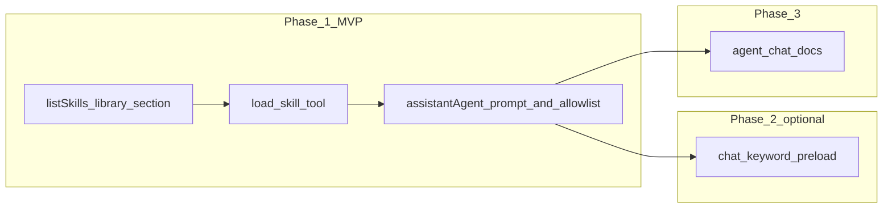

# OPP-035: Intent-Based Skill Auto-Loading

**Status:** Implemented (2026-04-25). Phase 2 keyword pre-load in `chat.ts` remains deferred (see Follow-ups).

## Problem

Currently, "Skills" (specialized instruction sets like `calendar`, `desktop`, or `commit`) are gated behind explicit slash commands (e.g., `/calendar`). If a user asks a calendar-related question without the slash command, the assistant uses its base system prompt, which contains only a high-level summary of the `calendar` tool. It misses the detailed guidance, edge cases, and workflows defined in the `SKILL.md` files.

This creates a "mode" problem: the user has to remember which skills are available and manually invoke them, rather than the assistant proactively adopting the best instructions for the task at hand.

## Proposal

Implement a mechanism for the `AssistantAgent` to auto-detect and load relevant skills based on the user's intent, while keeping the system prompt lean when no specialized skills are needed.

### 1. High-Level Skill Registry in System Prompt

Modify `buildBaseSystemPrompt` in [`assistantAgent.ts`](../../src/server/agent/assistantAgent.ts) to include a lightweight "Skill Library" section. This section will list the names and descriptions of all installed skills from `$BRAIN_HOME/skills/` (see [`skillsDir()`](../../src/server/lib/wikiDir.ts)).

```markdown
## Available Specialized Skills
If the user's request relates to any of these areas, you should proactively load the detailed skill instructions using the `load_skill` tool before proceeding:
- **calendar**: Manage calendars, schedule meetings, and control visibility.
- **desktop**: Troubleshoot Braintunnel macOS Braintunnel.app (Tauri) and bundled Node server.
- **commit**: Guides pre-commit verification and scoped lint/tests.
```

### 2. Add `load_skill` Tool

A new tool that allows the agent to pull the full content of a `SKILL.md` file into the current conversation context.

```typescript
defineTool({
  name: 'load_skill',
  label: 'Load skill instructions',
  description: `Load detailed instructions and workflows for a specialized skill.
Use when the user's request matches one of the skills listed in your 'Available Specialized Skills' library.
Loading a skill provides specific guidance on tool usage, edge cases, and best practices for that domain.`,
  parameters: {
    slug: string, // The slug of the skill to load (e.g., 'calendar')
  }
})
```

### 3. Automated Loading Heuristics (Optional but Recommended)

In the [`chat.ts`](../../src/server/routes/chat.ts) route, before initializing the agent session, perform a lightweight "intent check":

- If the user's message contains strong keywords (e.g., "calendar", "schedule", "meeting"), proactively load the `calendar` skill by appending its content to the `systemPrompt` during `getOrCreateSession`.
- This avoids the "cold start" problem where the agent has to decide to load a skill in its first turn.

### 4. Best Practice: "Manual" for Tools

Skills should be framed as the "manual" for specific tools. For example, the `calendar` tool provides the *capability*, but the `calendar` skill provides the *expertise* on how to use it effectively (e.g., "always check for conflicts before proposing a time").

---

## Design decisions (lock before coding)

### How skills enter context

| Option | Pros | Cons |
|--------|------|------|
| **A. `load_skill` tool** | Explicit, auditable in transcript (`tool_start` / `tool_end`), matches coding-agent patterns | Extra model turn if not pre-loaded |
| **B. Reuse `read` on wiki path** | No new tool | Skills live under `$BRAIN_HOME/skills/`, not the wiki vault |
| **C. Both** | Flexible | More surface area |

**Decision:** Implement **A** (`load_skill`) that reads via the same path as [`readSkillMarkdown`](../../src/server/lib/slashSkill.ts) (`skillsDir()` + `slug/SKILL.md`), strips frontmatter for the body (reuse `gray-matter` like `readSkillMarkdown`), and returns markdown. The wiki `read` tool is scoped to the vault root (`createReadTool(wikiDir)` in [`tools.ts`](../../src/server/agent/tools.ts)), so agents **cannot** load `$BRAIN_HOME/skills/...` via `read` — a dedicated tool is appropriate.

Document that the model should follow returned instructions for the rest of the turn and follow-ups in the same chat (they remain in message history once the assistant cites them). If product needs **sticky** system prompt mutation across turns without re-showing the blob, that is a follow-up (session state on `Agent`); v1 can rely on conversation history.

### Skill library in system prompt

- Add **`skillLibraryPromptSection()`** (or similar) in [`skillRegistry.ts`](../../src/server/lib/skillRegistry.ts): bullet list of `slug`, `name`/`label`, truncated `description` from frontmatter — reuse data from `listSkills()` or factor shared parsing.
- **`getOrCreateSession`** already builds `systemPrompt`: await the library section and append it to `buildBaseSystemPrompt` output. Handle missing `skills/` (empty section or omit section).
- **Performance:** One directory read per **new session** (not per message).

### Optional keyword pre-load (Phase 2)

- Implement in [`chat.ts`](../../src/server/routes/chat.ts) **only for non-slash** messages: if user text matches a small configurable map (`calendar` → `calendar` slug, etc.), append that skill’s body (after placeholders) to `systemPrompt` for that request’s `getOrCreateSession` options, **or** inject a single line: “Skill `calendar` is pre-loaded; follow it.”
- **Risk:** False positives (e.g. “calendar year” unrelated). Mitigate with conservative keyword lists or ship Phase 1 without pre-load first.

### Tool allowlist

- Add `load_skill` to [`ALL_AGENT_TOOL_NAMES`](../../src/server/agent/agentToolSets.ts) and to the appropriate `TOOL_GROUPS` (new `skills` group or `ui`).
- **Onboarding / profiling / wiki-cleanup** agents should **omit** `load_skill` (same rationale as other unrelated tools).

### Security and scope

- `load_skill` only resolves paths under `skillsDir()` + `[slug]/SKILL.md` with strict slug validation (`^[a-z0-9_-]+$` — align with [`parseLeadingSlashCommand`](../../src/server/lib/slashSkill.ts)).
- No arbitrary filesystem reads.

### Non-goals (v1)

- Mutating the Agent’s persisted `systemPrompt` after load for sticky instructions without relying on history — optional follow-up if needed.

---

## Feature roadmap



**Core behavior:** System prompt gets a compact skill index; the model calls `load_skill` when the task matches a listed skill; full `SKILL.md` body enters the turn via tool result (transcript-visible, coding-agent idiomatic).

---

## Implementation phases

### Phase 1 — Core (MVP)

1. **`skillRegistry.ts`** — Export `formatSkillLibrarySection(): Promise<string>` (or equivalent) using one code path with `listSkills()`.
2. **`tools.ts`** — Define `load_skill` with `slug`; validate slug; use `readSkillMarkdown` or shared helper; return body + metadata (name) or error string. Wire into `createAgentTools` with the same options pattern as other tools.
3. **`assistantAgent.ts`** — Append the skill library section to the system prompt; add routing lines: when the user’s task matches a listed skill, **call `load_skill` before relying on domain-specific workflows** (not for every trivial mention).
4. **`agentToolSets.ts`** — Register `load_skill` in `ALL_AGENT_TOOL_NAMES` and preset omit lists as decided.
5. **`chat.ts`** — No change required for MVP unless you add pre-load in Phase 2.

### Phase 2 — Optional pre-load heuristics

6. **`chat.ts`** — After parsing message, if not a slash command, run keyword → slug map; if hit, pass `preloadedSkillSlugs` or `extraSystemPrompt` into `getOrCreateSession` (extend `SessionOptions`).
7. **`assistantAgent.ts`** — Merge pre-loaded skill bodies into `systemPrompt` for that session creation only, or for the first turn — document behavior in code comments.

### Phase 3 — Polish

8. **Client (optional):** Subtle “Skill: calendar” chip when `load_skill` runs — only if cheap; otherwise transcript tool labels suffice.
9. **Docs:** Update [`agent-chat.md`](../architecture/agent-chat.md) with `load_skill` and skill library behavior.

---

## Implementation checklist

- [x] Modify [`skillRegistry.ts`](../../src/server/lib/skillRegistry.ts) to provide a helper for a "Skill Library Summary" (names + descriptions).
- [x] Update [`assistantAgent.ts`](../../src/server/agent/assistantAgent.ts): inject the summary into the base system prompt; add `load_skill` to the agent's toolset.
- [x] Implement `load_skill` in [`tools.ts`](../../src/server/agent/tools.ts): read `SKILL.md` via `skillsDir()` + validated slug; return content as tool result.
- [x] Update [`agentToolSets.ts`](../../src/server/agent/agentToolSets.ts): `load_skill` in allowlists / omit lists.
- [ ] Optionally update [`chat.ts`](../../src/server/routes/chat.ts) for keyword pre-load (Phase 2).
- [x] Tests: see below.

---

## Testing

### Unit tests

| Area | Location | Cases |
|------|----------|--------|
| Skill library formatting | `skillRegistry.test.ts` | Empty dir; one skill; many skills; stable ordering; description truncation if any |
| `load_skill` | Extend agent tools tests | Valid slug returns body; invalid slug errors; path traversal rejected; missing file |
| Slug validation | Same | `..`, `/`, unicode rejected |

### Integration / API

- **Manual or scripted:** `POST /api/chat` with a message like “What’s on my calendar tomorrow?” (no `/`) and verify in logs or SSE that `load_skill` appears before or with `calendar` tool use — model-dependent; flaky for strict assertions.
- **Prefer:** Unit tests for deterministic parts; **manual checklist** for LLM behavior (see validation).

### Regression

- Slash commands: `/calendar` still works via existing [`readSkillMarkdown`](../../src/server/lib/slashSkill.ts) path in `chat.ts`.
- `GET /api/skills` still lists skills from disk; each item includes an additive **`slug`** field.

---

## Validation (acceptance criteria)

Use this list to mark OPP-035 **done**:

- [x] **Library visible:** New chat session system prompt includes the agreed heading when at least one skill exists under `$BRAIN_HOME/skills/` (or bundled user-skills), via `formatSkillLibrarySection` in `getOrCreateSession`.
- [x] **`load_skill` works:** Unit tests + valid `myskill` fixture return markdown; a real `calendar` skill in dev works the same.
- [x] **No leak:** Invalid slug / traversal rejected in tool (`readSkillMarkdown` only resolves validated slugs under `skillsDir` + bundle).
- [x] **Assistant preset:** Main Brain assistant has `load_skill`; onboarding and wiki-cleanup omit it.
- [ ] **Manual UX:** A natural-language calendar question (without `/`) leads the model to load the skill or still answer correctly using calendar tools — **product owner sign-off** on one golden path.
- [x] **Docs:** [`agent-chat.md`](../architecture/agent-chat.md) updated to describe behavior; implementation checklist above checked off.

---

## Close-out (when shipped)

1. Mark all items in **Implementation checklist** and **Validation** as done (`[x]`).
2. Add a short **“Status: Implemented (date)”** note at the top of this doc with PR link if applicable.
3. If keyword pre-load was deferred, record under **Follow-ups** below.
4. Run scoped CI per [`AGENTS.md`](../../AGENTS.md): `npm run lint`, `npm run typecheck`, `npm run test` for touched packages.

---

## Risks and mitigations

| Risk | Mitigation |
|------|------------|
| Model ignores skill library | Stronger system prompt line + eval with real model |
| Token bloat from library section | Keep descriptions one line each; cap list length if needed |
| Duplicate loading (pre-load + `load_skill`) | Idempotent wording in prompt: “If already below, do not load again” |
| Session without skills dir | Graceful empty state |

---

## Follow-ups

- Optional: keyword pre-load in `chat.ts` (Phase 2).
- Optional: sticky system prompt / Agent state for skill text without relying on transcript history.

---

## Related

**Opportunities**

- [OPP-031: Preference and Memory Tools](./archive/OPP-031-preference-memory-tools.md) — Skills provide the *how*, preferences provide the *what*.
- [OPP-010: User Skills](./archive/OPP-010-user-skills.md) — Original vision for user-defined skills.
- [OPP-025: Cross-Platform Agent Skills Packaging](../../ripmail/docs/opportunities/archive/OPP-025-cross-platform-agent-skills-packaging.md) — Packaging and distribution of skills.

**Code (implementation references)**

- [`slashSkill.ts`](../../src/server/lib/slashSkill.ts) — `readSkillMarkdown`, placeholders
- [`skillRegistry.ts`](../../src/server/lib/skillRegistry.ts) — `listSkills`
- [`assistantAgent.ts`](../../src/server/agent/assistantAgent.ts) — session factory
- [`chat.ts`](../../src/server/routes/chat.ts) — slash vs normal flow
