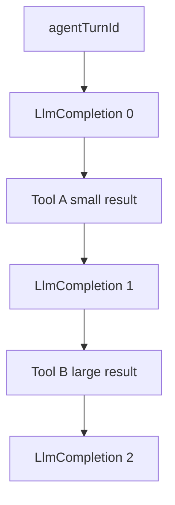

# OPP-046: New Relic LLM/turn telemetry (trace-style) + local usage export CLI

**Status:** Proposed.

## Summary

Send **well-correlated observability** to New Relic for each `agent.prompt()` “turn”: **LLM token/cost** (per completion and rolled up), **tool execution latency** (existing `ToolCall` path), and **approximate tool-output footprint** so operators and engineers can find **token-efficiency bottlenecks**—including cases where a tool is “expensive” because it returns a **large** result that inflates the **next** model context. In parallel, add a **first-party `npm` script** that reads **local** `$BRAIN_HOME` JSON ([`chats/`](../../src/server/lib/chatStorage.ts), [`background/runs/`](../../src/server/lib/backgroundAgentStore.ts)) and prints rollups, since that ad hoc analysis is a recurring workflow.

**Builds on:** [OPP-043](OPP-043-llm-usage-token-metering.md) (durable `usage` on messages / background docs), [docs/newrelic.md](../newrelic.md) (`ToolCall` custom events, privacy rules).

---

## Terminology (what is measurable)

| Phrase | Correct meaning in this stack |
|--------|------------------------------|
| **Tokens (provider usage)** | Reported on each **`AssistantMessage`** (each model HTTP completion) via pi-ai `usage`—not on tool `execute()` itself. |
| **“Tokens per tool” (strict)** | **Not** directly reported. The model does not attribute token buckets to a tool name. |
| **Tool wall time** | Real: `tool_execution_start` → `tool_execution_end` (already `durationMs` on `ToolCall`). |
| **Tool influence on *future* token cost** | **Indirect but important:** tool results are injected into the **next** (or subsequent) user/tool-result **context** the model sees. A **large** result tends to increase **input** tokens on the **next** LLM call (subject to provider truncation, caching, and prompt assembly). |
| **Trace / span (product language)** | We use a **shared correlation id** (`agentTurnId`) across custom events; optionally **in-process APM segments** for tools (see below). This is **trace-like** for NRQL and dashboards, not a claim of full OpenTelemetry semantics unless we add that later. |

**Takeaway for optimization:** You generally optimize **(a)** which tools run and how often, **(b)** **how big** the serialized tool results are (shape, filters, caps), and **(c)** model choice—using **result size** and **per-completion** token metrics as the levers you can see in data.

---

## Problem

1. **New Relic today** records [`ToolCall`](../../src/server/lib/newRelicHelper.ts) with `durationMs`, `toolName`, sanitized `paramsJson`, and correlation to `sessionId` / `backgroundRunId` / `workspaceHandle`—but **not** to a single **turn** id, and **not** with **LLM usage** or **result size**. Operators cannot easily answer: “For this tenant/session, what did we spend, and which steps dominated?”
2. **OPP-043** stores usage **on disk**; NR does not see it without explicit emission.
3. **Engineers** repeatedly aggregate usage from local JSON; that should be a **supported** CLI, not one-off `jq`.
4. **Bottleneck hunting:** Teams want to know whether inefficiency is **model churn** vs ** fat tool payloads**; we need **approximate** (not billing-grade) signals that line up in the same **correlated** event stream as completions.

---

## Goals

| Area | Requirement |
|------|-------------|
| **Turn correlation** | Every instrumented `agent.prompt()` run gets a stable **`agentTurnId`**, shared by tool events and LLM events for that run. |
| **LLM usage in NR** | Emit per-turn and per-**completion** custom events (token buckets + `costTotal` where available), aligned with [`llmUsage.ts`](../../src/server/lib/llmUsage.ts) shapes. |
| **Tool timing** | Keep / extend `ToolCall`; add `agentTurnId` + **sequence** within the turn. |
| **Tool output footprint (approximate)** | For each tool completion, record **sanitized, bounded** metrics such as **`resultCharCount`** (and/or `resultWasTruncated`, optional **size bucket** e.g. `0-1k` / `1k-8k` / `8k+`) from the same string the app already uses for SSE/truncation—**never** send raw result bodies. Use this to spot tools that habitually return huge payloads that bloat the **next** context. |
| **Trace-style analysis** | NRQL can `WHERE agentTurnId = '…'` to reconstruct order: completions vs tools; facet by `toolName` + size bucket for “heavy tools.” |
| **Local CLI** | `npm` script to summarize usage from `chats/*.json` and `background/runs/*.json` under `$BRAIN_HOME`. |
| **Privacy** | Follow [../newrelic.md](../newrelic.md): no raw tool results, no secrets; size metrics only. |

## Non-goals (initially)

- **Authoritative** billing or perfect per-tool token attribution.
- **Strict** “this tool used N tokens” (provider does not report that).
- Replacing the whole stack with **OpenTelemetry** export (can revisit).
- A **separately published** npm **registry** package (in-repo script is enough; a `packages/usage-cli` split is a later optional refactor).

---

## Technical approach: semantic model (“trace” shape)

**Root:** one **`agentTurnId`** = one `agent.prompt()` (chat reply or one wiki enrich/cleanup invocation).

**Child observations (ordered by `sequence` / `completionIndex`):**

- **`LlmCompletion` events** — one per **assistant** model completion; carries **actual** `usage` fields from pi-ai (per completion).
- **`ToolCall` (extended)** — one per **finished** tool; carries **wall-clock** `durationMs`, plus **approximate** **`resultCharCount`** (or bucket) after the same sanitization/truncation path used for streaming—**not** a token count, but a **practical** proxy for “this tool fed a lot of text back into the loop.”

**Why `resultCharCount` is useful (approximate):** The **next** `LlmCompletion`’s `input` tokens (and cache behavior) are driven in part by **conversation + tool result text length**. You cannot equate bytes to tokens without a tokenizer, but **ranking** tools by p95 `resultCharCount` and correlating with **per-completion** `input` in NRQL is a standard way to find **which tools to trim** (smaller results, stricter `grep`, fewer rows from `read_email`).

**Optional (later):** A documented **heuristic** to label a completion’s input as *likely dominated by* “previous tool results” (e.g. diff input tokens before/after a known tool) — still an estimate; keep as research, not a promise in v1.

---

## New Relic: hybrid recommendation

| Mechanism | Role |
|-----------|------|
| **Custom events (primary)** | `LlmAgentTurn` (rollup at end of run), `LlmCompletion` (per assistant message), extended `ToolCall` — all share `agentTurnId` + existing correlation fields. **Numeric attributes** stay within NR’s typical custom-event limits; use **buckets** if attribute cardinality is a concern. |
| **In-process APM segments (optional)** | `startSegment` (or equivalent) around **tool execution** for native waterfall under the long `POST /api/chat` transaction. **Does not** auto-capture LLM SDK time without deeper instrumentation. |
| **“Distributed trace” across services** | **Not** required for a single Node process. |

**Planned custom event types (alphanumeric names; update [../newrelic.md](../newrelic.md) when implemented):**

| Event type | When | Key attributes (non-exhaustive) |
|------------|------|----------------------------------|
| `LlmAgentTurn` | End of `agent_end` (or equivalent) for one `prompt()` | `agentTurnId`, `source` (`chat` \| `wikiExpansion` \| `wikiCleanup`), `sessionId` / `backgroundRunId`, `workspaceHandle`, token totals, `costTotal`, `turnDurationMs`, `completionCount`, `toolCallCount` |
| `LlmCompletion` | Each **assistant** message with `usage` in the run | `agentTurnId`, `completionIndex`, `input`, `output`, `cacheRead`, `cacheWrite`, `totalTokens`, `costTotal`, optional `model` / `provider` if policy allows |
| `ToolCall` (extend) | Today’s event + | `agentTurnId`, `sequence` (int), `resultCharCount` (or band), `resultTruncated` (bool) — **no** `result` text |

**Instrumentation sketch:** Generate `agentTurnId` at the start of the subscribed run in [`streamAgentSse.ts`](../../src/server/lib/streamAgentSse.ts); pass into `recordToolCallEnd` (and compute result size from the same string used for SSE, before or after client truncation, **document the choice in code**). For wiki, mirror in [`wikiExpansionRunner.ts`](../../src/server/agent/wikiExpansionRunner.ts) `attachRunTracker`. Emit `LlmCompletion` from each assistant message in `agent_end.messages` (or equivalent), and one `LlmAgentTurn` rollup using [`sumUsageFromMessages`](../../src/server/lib/llmUsage.ts).

---

## Local usage export CLI (npm script)

**Inputs:** `BRAIN_HOME` (env or flag); optional filters.

**Reads:**

- `chats/*.json` — for each session, sum `messages[].usage` for `role === 'assistant'`.
- `background/runs/*.json` — `usageLastInvocation`, `usageCumulative` per run.

**Output:** `--json` (one blob), `--ndjson` (per line), or **human** table; `--help` documents paths ([data-and-sync.md](../architecture/data-and-sync.md)).

**Deliverable shape:** e.g. `node scripts/brain-usage.mjs` + `npm run usage:export` in root [`package.json`](../../package.json) (exact name TBD in implementation).

**Non-goal:** Publishing to the public npm registry as a separate package in v1.

---

## Dependencies

- **Soft dependency on OPP-043** for on-disk **validation** of the same `usage` numbers; NR emission can be implemented in parallel.
- **Enables** Ops dashboards, support correlation, and internal **token-efficiency** work (with **result-size** + **LLM** columns).

---

## Acceptance criteria

1. **Spec** (this OPP) explains **hybrid** NR strategy, **trace-like** correlation, and **LLM vs tool** semantics without false “tokens per tool” claims.
2. **Spec** calls for **tool result size** (approximate) alongside **LlmCompletion** / **LlmAgentTurn** events to support **bottleneck** analysis.
3. **Spec** defines **local CLI** behavior and `npm` script expectations.
4. **Implementation** (later) updates [../newrelic.md](../newrelic.md) custom event table and extends [`newRelicHelper.ts`](../../src/server/lib/newRelicHelper.ts) / [`newrelic.d.ts`](../../src/server/types/newrelic.d.ts) as needed.

## References

- [OPP-043](OPP-043-llm-usage-token-metering.md) — on-disk token metering
- [../newrelic.md](../newrelic.md) — account, `ToolCall`, privacy
- [../architecture/data-and-sync.md](../architecture/data-and-sync.md) — `chats/`, `background/`
- [../architecture/agent-chat.md](../architecture/agent-chat.md) — SSE, persistence
- [../architecture/pi-agent-stack.md](../architecture/pi-agent-stack.md) — `Agent` events, `usage` origin
- [`src/server/lib/llmUsage.ts`](../../src/server/lib/llmUsage.ts) — `sumUsageFromMessages`, `LlmUsageSnapshot`
- [`src/server/lib/newRelicHelper.ts`](../../src/server/lib/newRelicHelper.ts) — `recordToolCallEnd`
- [`src/server/lib/truncateJson.ts`](../../src/server/lib/truncateJson.ts) — bounded tool result text (size metrics should align with what the model effectively sees after truncation)

---

*See also: [../architecture/README.md](../architecture/README.md)*
