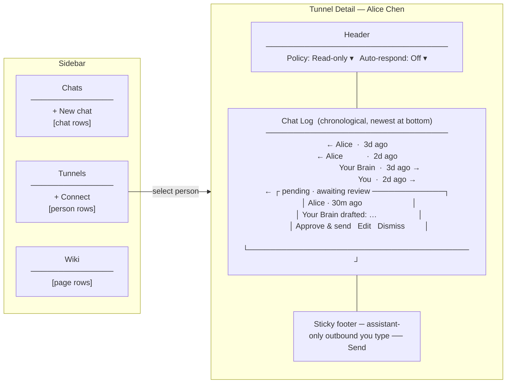

# Archived: OPP-113 — Tunnel connections: unified B2B activity surface

**Status: Archived (2026-05-14).** **Checkpoint shipped:** Tunnels primary sidebar + list/detail surface, **`/tunnels/:handle`**, timeline-oriented tunnel UI, Connect flow, review API integration for pending rows; residual UX (dual compose model, bubble attribution polish, Vitest coverage) continues as normal product work—file new OPPs if a discrete milestone is needed. **Stub:** [../OPP-113-tunnel-connections-unified-activity-surface.md](./OPP-113-tunnel-connections-unified-activity-surface.md)

---

# OPP-113 — Tunnel connections: unified B2B activity surface

**Status:** Archived (2026-05-14) — narrative retained for reference.  
**Area:** Navigation / IA / UI — B2B tunnels  
**Complexity:** Large (touches nav model, primary surface, new data views)  
**Related:** [OPP-112](./OPP-112-review-queue-ux-overhaul.md) (review UX; Issues 7–8 folded in), [OPP-110](./OPP-110-chat-native-brain-to-brain.md) (chat-native B2B), [OPP-111](./OPP-111-tunnel-fast-follows.md) (review queue + auto-send)

---

## Checkpoint — what’s landed vs next

**Landed (checkpoint committed):**

- Tunnels as a primary sidebar section, list + detail activity surface, timeline-oriented UI, Connect / cold-query entry improvements (including reusing the main chat `UnifiedChatComposer` patterns where applicable), and scaffolding around tunnel messages — enough to demo and manually exercise flows.

**Explicitly deferred (before locking tests):**

- **Vitest/component coverage** for tunnel-detail compose, draft lifecycle, and “To” semantics — intentional delay until **in-context vs sticky compose** UX is redesigned (see below) so tests don’t chase a moving UI.
- **Manual UI QA** across two-account scenarios (grant states, outbound-not-established banners, recipient affordances).

**Current pain:** The sticky bottom **“To: their brain / them” + single field** overloads multiple intents. Needed is a clearer split between **(A) user-authored outbound to their assistant** and **(B) acting on drafts your brain produced** — without cramming both into one control.

---

## UX refinement — dual compose model (direction)

This supersedes the earlier “one compose bar, recipient pill switches brain vs human” framing for **how** compose works; the **chat-log metaphor** stays.

### 1. Sticky bottom bar — outbound you type

- **Purpose:** Messages **you compose yourself** outbound.
- **Routing rule:** These **always go to the other user’s assistant** (their brain). No mixed “direct to them vs their brain” mode in this bar — that simplifies the mental model.
- **Copy/affordances:** Tune placeholder and labeling so it is obvious this is **you → their assistant** (assistant-path outbound only).

### 2. In-context widget — drafts and approvals near the bubble

- **Purpose:** Anything that needs **approve, edit, defer, or ignore** on something **your brain already drafted** on your behalf (or that’s surfaced as an actionable outbound/inbound draft in the timeline).
- **Gesture:** Selecting / clicking the relevant bubble (draft, pending outbound, inbound query + draft) **anchors a combined widget in context** beside or under that bubble — **not** only forcing action from the footer.
- **Widget contents (combined):**
  - **Editable text** (the draft body you can revise).
  - **Send** — ship current text when it looks good (`AgentInput`/composer-style semantics: satisfied with transcript → submit).
  - **Modify / apply changes** — save edits **without sending** yet (or equivalent wording: commits local draft edits so “Send” is a separate deliberate step — exact interaction TBD during implementation).
  - **Ignore / dismiss** — clear the obligation without sending, when applicable.

This restores clarity: footer = **fresh outbound you write** to their assistant; in-log = **decision surface on drafts**.

### 3. Bubble differentiation (their brain vs yours, approved vs authored)

**Attribution rule (non‑negotiable for UX copy and labels):** **Human‑initiated asks never use a brain label** (yours or theirs). A line like “please summarize the Dynergy merger” that **demo‑steve‑kean** sent is **Steve / @handle**, not “Steve’s brain.” The same for **their** questions to you — e.g. “What are Cirne’s Q3 availability policies?” from **Alice** is **`Alice`**, not “Alice’s brain.” **Assistant** turns use brain labels for **replies** (auto‑sent or approved), **draft‑pending** copy (“your brain drafted…”), etc. Your assistant may still **relay** messages on the wire; the timeline reads ***people ask*, *brains answer*.**

Today similar styling for “your brain vs you” hides important nuance:

- Add **distinct visual treatment** (e.g. **color, accent, icons**) for:
  - **Messages you authored** (human-typed outbound in your voice — **including outbound queries to their assistant**; never mis‑label those as “your brain”).
  - **Responses your brain produced** (auto‑sent or after **you** approved) — optionally badged differently when you **edited before approve** vs **approved verbatim**.

Goal: At a glance, see “**I asked this**” / “**Alice asked this**” vs “**my brain answered / drafted this**” vs “**their brain answered**.”

### 4. Simplifying rule of thumb for users

| Kind | Goes to | Typical UI |
|------|---------|------------|
| **Outbound you type now** | **Their assistant** | Sticky footer compose |
| **Draft your brain wrote** | Depends on approval flow | In-context anchored widget |
| **Response / reply leg** | Often **toward the peer user** narrative | Resolved in-log with labels |

Exact routing should stay faithful to backend capabilities; UX copy should not promise direct human pipes where the protocol is assistant-mediated only.

---

## Problem

The nav currently has two primary sections — Chats and Wiki — with tunnels awkwardly embedded inside Chats as a sub-section rail. This conflates two distinct things:

- **Chats** are conversations between you and your own assistant.
- **Tunnels** are B2B connections between your brain and other people's brains — a completely different communication model.

There is no person-oriented view of your tunnel relationships. You cannot see inbound and outbound activity with a specific person in one place. You cannot manage policies or auto-respond settings with any discoverability. The older separate **Review** surface felt disconnected from tunnel-by-person navigation.

---

## Concept: Three primary sections

The sidebar becomes three first-class sections:

```
Sidebar
├── Chats
│   ├── + New chat
│   └── [your conversations with your assistant]
├── Tunnels
│   ├── + Connect
│   └── [person rows, sorted by recent activity]
└── Wiki
    └── [wiki page rows]
```

**Chats** = you and your assistant. Unchanged from today.

**Tunnels** = every person your brain has a B2B tunnel relationship with, inbound or outbound. One row per person. This replaces the Tunnels sub-section in ChatHistory, the Inbox tunnel entries, and the retired client **`/review`** page route (pending data remains on **`GET /api/chat/b2b/review`**).

**Wiki** = your wiki. Unchanged from today.

Email is **not** part of this surface. Tunnel communication is Braintunnel-native B2B — it has its own model, its own permissions, and its own UX. Combining it with email would dilute both.

---

## The four-actor model

A tunnel connection involves four distinct actors, and the detail pane must make all of them legible:

| Actor | Description |
|-------|-------------|
| **You** | The signed-in human user |
| **Your Brain** | Your assistant — drafts/handles **responses** to inbound queries; **may relay** outbound asks you compose, but the tunnel log **attributes the ask to you**, not to “your brain” (see UX refinement §3) |
| **Them** | The other human user |
| **Their Brain** | Their assistant — **responds** to your outbound (and paths through it); **bubble labels** use **Alice** for **her** asks, **Alice’s Brain** for **assistant-authored replies** (see UX refinement §3) |

The communication flows that matter in a single tunnel relationship:

| Flow | Direction | Who acts |
|------|-----------|----------|
| **Inbound queries** | Their Brain → Your Brain (wire) | **Alice** (or handle) on the **question** bubble when she originated the ask; your brain drafts a response; you approve or auto-respond |
| **Outbound queries** | You → Their Brain (often **relayed** by your assistant) | **You** originate the ask (composer / session); **label the outbound bubble as the person**, not “your brain.” Their brain responds (or their human approves); those legs are brain‑labeled as appropriate |
| **Direct message** | You → Them | You can send a direct human-to-human message through the tunnel |

The first two flows are what most B2B tunnel activity is. The third is a simpler "ping this person" capability that doesn't go through either brain.

---

## The tunnel list (left pane)

Each row in the Tunnels section shows:

- **Avatar / initials** for the person
- **Name** (display name or handle)
- **Direction state** — a small icon: inbound-pending, outbound-pending, active/bidirectional, idle
- **Snippet** — last activity preview (query text or response summary, truncated)
- **Timestamp** — relative time
- **Badge** — unread or pending-review count

Rows are sorted by most recent activity. A `+ Connect` button at the top opens the flow to initiate a new tunnel with someone (formerly "Open a Braintunnel").

---

## The tunnel detail pane (right side)

**The detail pane is a chat history.** That's the whole metaphor. One scrollable log of everything that has ever passed through this tunnel — inbound queries, outbound queries, your brain's responses, their brain's responses, and direct messages between the humans. A header at the top with the connection controls. A compose bar at the bottom. Nothing else.

The four-actor model collapses to **two sides** in the chat:

- **Your side** (right-aligned): **You** (human outbound + direct messages) and **Your Brain** (**responses** / auto-sent / approved replies — not the outbound question bubble)
- **Their side** (left-aligned): **Them** (their **questions** and direct messages) and **Their Brain** (**their assistant’s replies** to you — not their human’s question bubbles)

Each message bubble has a small actor label (`You`, `Your Brain`, `Alice`, `Alice's Brain`) and a timestamp. **Use brain labels for assistant *responses*** (and draft/review copy: “your brain drafted…”). **Peer *questions* they originate** are **`Alice` / handle**, not “Alice’s brain,” even when delivery is assistant-mediated (same rule as your outbound: *people ask*, *brains answer*). **Do not** label **your** outbound ask as “your brain.” See **UX refinement §3**. That label is the *only* place the four-actor distinction appears — there are no tabs, no filters, no sub-views. You read down the log like any other chat and the actor labels tell you who said what.

### Sketch

```
┌─────────────────────────────────────────────────────────────┐
│ [Avatar]  Alice Chen  @alice.brain.id                       │
│           Policy: [Read-only ▾]   Auto-respond: [Off ▾]     │
├─────────────────────────────────────────────────────────────┤
│                                                             │
│  Alice · 3d ago                                             │
│  "What are Cirne's Q3 availability policies?"               │
│                                                             │
│                            Your Brain · 3d ago · auto-sent  │
│                       "Based on the calendar, available…"   │
│                                                             │
│  Alice · 2d ago                                             │
│  "Hey — got a sec to look at the doc?"                      │
│                                                             │
│                                       You · 2d ago          │
│                                       "On it, ping me 4pm." │
│                                                             │
│                                       You · 5h ago          │
│              "Can you summarize Alice's Acme notes?"        │
│  Alice's Brain · 5h ago                                     │
│  "Alice has three notes on Acme: …"                         │
│                                                             │
│  ┌─ Alice · 30m ago · awaiting your review ────────────────┐ │
│  │ "What's your stance on the partnership?"               │ │
│  │ Your Brain drafted:                                    │ │
│  │ "Based on recent notes, leaning toward…"               │ │
│  │ [Approve & send]  [Edit]  [Dismiss]                    │ │
│  └────────────────────────────────────────────────────────┘ │
│                                                             │
├─────────────────────────────────────────────────────────────┤
│  [Message Alice's brain...]                          [Send] │
└─────────────────────────────────────────────────────────────┘
```

*Interpretation:* the pending card evolves into **in-context anchored draft UX** (`Send` / `Modify` / `Dismiss` semantics); bottom row is **only** outbound you type → **their assistant** (recipient pill superseded).

### Header — connection controls

Always visible at the top:

- **Policy selector** — dropdown showing what access this person's brain currently has to yours (none / read-only / full / etc., mapping to the existing policy model). Change takes effect immediately.
- **Auto-respond** — dropdown for whether your brain auto-sends drafts back to Alice (Off / Auto-send / etc.).

That's the whole settings surface for this connection. No separate "settings" view, no overflow drawer.

### Body — the chat log

A single chronological message log. Cases that fall out naturally from the metaphor:

- **Auto-respond is on:** your brain's responses appear in the log as normal "Your Brain" messages, marked `auto-sent`. You scroll back to audit what your brain said on your behalf — exactly the use case that makes auto-respond comfortable to enable.
- **A response is pending your review:** the inbound query and the drafted response appear as a single highlighted "card" bubble in the log, in chronological position, with inline `Approve & send` / `Edit` / `Dismiss` actions. No separate review queue, no jump-to-action surface — the action *is* in the chat.
- **You queried their brain:** the **outbound question** is always a **“You”** bubble (human attribution — see refinement §3). **Your Brain** appears only on **your side’s replies** (and pending‑draft cards), not on the ask. The reply from their side shows as a normal "Alice's Brain" bubble below. Tapping opens the full outbound chat session in Chats when needed.

- **You messaged Alice directly:** if still desired, modeled outside the ambiguous sticky footer (**placement TBD** — see Open questions).

If multiple drafts are pending and you don't want to scroll, the most recent pending card is implicitly anchored near the bottom (just above the compose bar) — it lives at its true chronological position *and* sticks to the bottom until acted on. This is the only deviation from pure log order.

### Compose bar

**Target model (OPP-113 refinement):**

- **Sticky footer:** Dedicated to **your new outbound prose to their assistant** — not for resolving brain drafts or toggling ambiguous recipients. Optionally link “open full session in Chats” from bubbled items as today.
- **In-context anchored controls:** Pending approvals, edits to brain drafts, and “send vs modify-then-send” belong **near the timeline bubble** via the combined draft widget described in **Checkpoint / UX refinement** above.

Historical sketch (prior “recipient pill” in one bar) informed early prototypes; superseded by splitting **sticky vs in-context**.

```
[Sticky] Type to message {{their assistant}} …        [Send]
```

```
[In-context, anchored to bubble]
  ┌─────────────────────────────────────────────┐
  │ [ editable draft textarea / composer chip ] │
  │  [Dismiss]              [Modify]   [Send]   │
  └─────────────────────────────────────────────┘
```

Exact labels (`Modify` vs `Apply changes`), and whether edits auto-save draft server-side vs local-only until Send, ship during implementation once flows are exercised manually.

---

## Diagrams

### Layout



### Four-actor message flows

```mermaid
sequenceDiagram
    participant You
    participant YB as Your Brain
    participant AB as Alice's Brain
    participant Alice

    Note over AB,YB: Inbound query (auto-respond off)
    AB->>YB: "What are your Q3 policies?"
    YB-->>You: pending bubble in chat log
    You->>YB: Approve & send
    YB->>AB: approved response

    Note over YB,AB: Inbound query (auto-respond on)
    AB->>YB: "Partnership stance?"
    YB->>AB: auto-sent response
    Note over You: "auto-sent" bubble appears in log

    Note over You,AB: Outbound query
    You->>YB: send query via compose bar
    YB->>AB: outbound query (relay)
    AB->>YB: response
    Note over You: log labels the ask as You; brains only on reply bubbles

    Note over You,Alice: Direct human-to-human
    You->>Alice: direct message
    Alice->>You: direct reply
```

---

## How this changes the nav

### Before (current)

```
Sidebar
├── Chats (section)
│   ├── + New chat
│   ├── [chat rows...]
│   ├── Tunnels (sub-section)
│   │   ├── Inbox (N) → pending (API-backed; opens `/tunnels/:handle`)
│   │   ├── + Open a Braintunnel
│   │   └── [tunnel rows...]
└── Wiki (section)
    └── [wiki page rows...]

Dock zones:
  /c (chat) | /inbox (email) | /wiki | /hub  _(legacy `/review` / bare `/tunnels` client routes removed)_
```

### After (proposed)

```
Sidebar
├── Chats (section)
│   ├── + New chat
│   └── [chat rows...]
├── Tunnels (section)
│   ├── + Connect
│   └── [person rows...]
└── Wiki (section)
    └── [wiki page rows...]

Dock zones:
  /c (chat) | /tunnels/:handle (tunnel detail) | /wiki | /hub  _(bare `/tunnels` and `/review` URLs normalize to `/c`; tunnel list lives inside the Tunnels overlay, not as its own path.)_
```

Key changes:

1. **Tunnels** becomes a first-class sidebar section alongside Chats and Wiki.
2. **Client `/review` is retired** — pending inbound queries appear as "Pending" items in the tunnel detail pane (`/tunnels/:handle`), not a separate browser path. The **`GET /api/chat/b2b/review`** API remains for pending rows.
3. **Tunnels sub-section inside ChatHistory is removed** — the Tunnels section in the sidebar replaces it.
4. **`+ Open a Braintunnel`** becomes `+ Connect` at the top of the Tunnels section.
5. Email (`/inbox`) remains its own separate surface and is not affected by this change.

---

## Design principles for the detail pane

The four-actor model is genuinely complex. The point of "make it feel like a chat history" is to *not* expose that complexity as UI. The principles:

1. **One log, two sides, four labels.** Right side = **you** plus **your brain's replies**. Left side = **them** plus **their brain's replies**. **Brains are for assistant-authored *responses*** (and related draft UI); **people** label **questions** (you and the peer). Actor labels on every bubble. No tabs. No filter chips. No "Inbound" / "Outbound" / "Pending" sub-views. The user reads down the log like any chat thread.

2. **Header is the only settings surface.** Policy and auto-respond live in the header — always visible, one click to change, no drawer or settings view. If a future setting needs to live here, it goes in the header or it doesn't exist.

3. **Draft actions belong in-context on the timeline.** A draft awaiting approval or refinement is anchored to its bubble — combined input + Send / Modify / Ignore — not delegated to only the footer. The footer is for net-new outbound you type **to their assistant**.

4. **Auto-respond is auditable by scrolling.** When auto-respond is on, your brain's outbound replies show up in the log marked `auto-sent`. The chat-history metaphor *is* the audit trail — there's no separate "what did my brain say" view to build because it's already there.

5. **Sticky footer = outbound you author to their assistant.** In-context widget = drafts and approvals near the originating bubble — different shapes for different intents; avoid collapsing both into one recipient dropdown.

6. **Bubble styling encodes custody.** Differentiate bubbles for human-authored outbound vs assistant-authored **responses** (and optionally edited-vs-verbatim approvals). Do not label outbound questions as coming from a brain.

7. **Outbound chat sessions stay in Chats.** When you query their brain, the full back-and-forth lives in Chats as a normal chat session. The Tunnels detail shows the query and reply as bubbles in the log; tapping opens the Chats session for the full context. We don't duplicate the chat UI inside Tunnels.

---

## Open questions

1. **Outbound queries as sessions.** Today, outbound B2B queries open as chat sessions in the Chats section. Should they stay there (so you have a full chat context) and just be *reflected* in the Tunnels detail timeline? Or should they live only in Tunnels? The cleanest model is probably: outbound queries live in both places — the session is in Chats (full history) and the Tunnels detail shows a summary card that links to the session.

2. **Person identity and matching.** The tunnel list is organized by person. What is the identity key — brain ID, email, some other handle? If you have multiple tunnels open with the same person (different topics), do they merge into one person row or stay separate?

3. **Notification routing.** Inbound B2B drafts route to **`/tunnels/:handle`** (peer handle from the notification payload). The pending badge on the Tunnels sidebar section communicates urgency.

4. **What happens to `/inbox`?** This OPP does not affect the Inbox surface. It remains at `/inbox` for email. The dock icon / nav entry for inbox stays. Tunnels use **`/tunnels/:handle`** for the navigable detail URL; the rail still lists people and pending counts without a dedicated bare **`/tunnels`** list route (bookmarks to **`/tunnels`** or **`/review`** normalize to **`/c`**).

5. **Empty state.** A user with no tunnel connections sees the Tunnels section with only the `+ Connect` row and a brief explainer. A connection with no activity yet (just established) shows the connection header with policy/auto-respond and an empty timeline with a prompt.

6. **Direct human messaging in tunnels.** Older concept had a footer recipient pill for messaging the human directly vs their brain; the refinement makes sticky footer assistant-only until we decide where (if anywhere) explicit **You → Them** messages live (separate gesture, omit for v1, etc.) — needs product/backend alignment before tests.

7. **Test plan timing.** Prefer **Vitest/component tests after** sticky vs in-context compose and bubble styling converge; meanwhile rely on scripted two-account manual passes.

## Implementation sketch (not a plan — just enough to prove feasibility)

### Data

- **Tunnel connections list:** derive from `brain_query_grants` + `chat_sessions`, grouped by remote brain identity. Merge inbound grants and outbound sessions by the same remote party.
- **Activity timeline:** for a given connection — inbound B2B sessions (their queries to your brain), outbound B2B sessions (your queries to their brain), and direct messages (new table). Sorted by `created_at`.
- **Policy + auto-respond:** fields on the connection/grant record, writable via `PATCH /api/tunnels/:handle`.

### Router

- `RouteZone`: **`'tunnels'`** with a detail route at **`/tunnels/:handle`** (e.g. `/tunnels/alice`). No client **`/review`** path; no first-class bare **`/tunnels`** URL (direct hits redirect to **`/c`**).
- Tunnels sub-section removed from ChatHistory sidebar (replaced by first-class Tunnels section + handle-scoped navigation).

### Components

- `Tunnels.svelte` — primary surface (list + detail split).
- `TunnelRow.svelte` — person row with state icon, name, snippet, timestamp, badge.
- `TunnelDetail.svelte` — header (policy, auto-respond) + chat log + **sticky compose** (assistant-only outbound you type — **dual-mode refactor pending**).
- `TunnelMessage.svelte` — single bubble with side alignment, actor label, timestamp, body; evolve toward **distinct treatments** for human-authored vs brain-sent-with-approval (and optional edited-vs-verbatim cues).
- `TunnelPendingMessage.svelte` — inbound query + draft; grow into **anchored in-context composer** (editable draft + Send + Modify / apply + Dismiss / ignore per refined UX — may compose `UnifiedChatComposer` or thinner input + actions; revisit vs `ReviewDetail.svelte`).
- **`TunnelDraftActionBar` (conceptual)** — optional extract for the anchored “combined widget” beside a bubble once interaction design stabilizes.

---

## Relationship to existing opportunities

| OPP | Disposition |
|-----|------------|
| [OPP-112](./OPP-112-review-queue-ux-overhaul.md) Issues 1–6 | Already shipped; action affordances reused in `TunnelActivityCard` |
| OPP-112 Issue 7 (sender info + policy panel) | Folds into `TunnelDetail` connection header — policy selector lives there |
| OPP-112 Issue 8 (cold-query initiation) | `+ Connect` in Tunnels section header |
| [OPP-110](./OPP-110-chat-native-brain-to-brain.md) (chat-native B2B) | Outbound query sessions still live in Chats; Tunnels detail shows the query and reply as bubbles in the chat log, linking to the full session in Chats |
