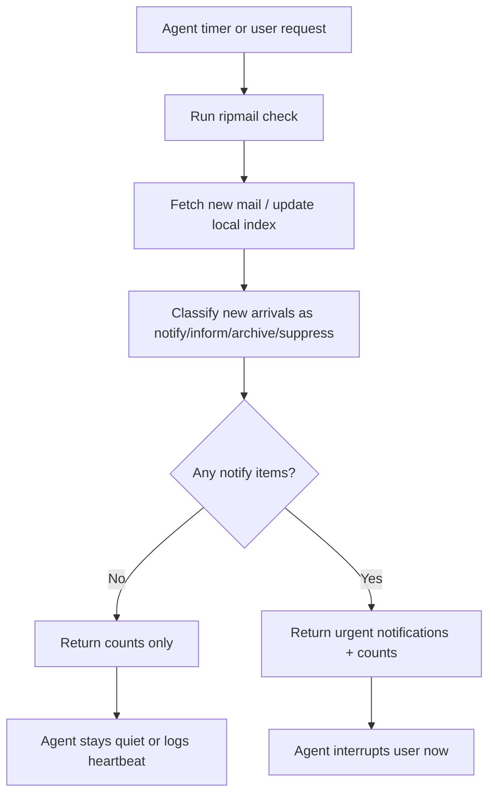
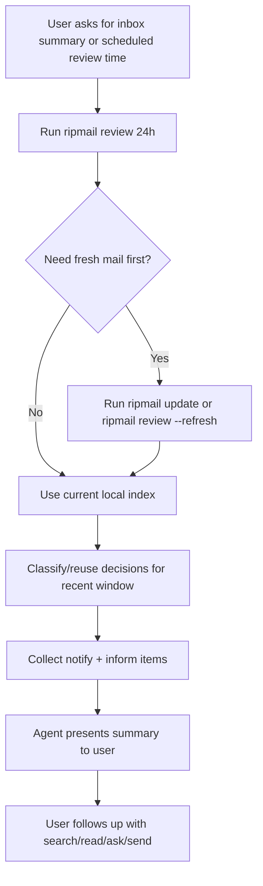
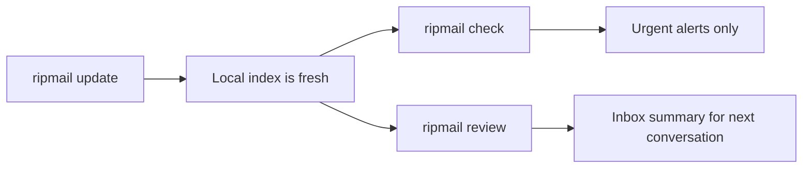

# OPP-034: Simplified Inbox CLI — `update`, `check`, and `review`

**Status:** Archived. **Created:** 2026-04-01. **Updated:** 2026-04-04. **Tags:** cli, inbox, agent, review, check, notify, inform, workflow

**Superseded (2026-04-04):** The **`update` / `check` / `review`** shape described below was **not** the final CLI. Shipped surface: **`ripmail refresh`** (fetch/backfill), **`ripmail inbox`** (deterministic triage), **`ripmail rules`**, **`ripmail archive`**. See [OPP-036 archived](archive/OPP-036-inbox-triage-orthogonal-archive.md) and [OPP-037 archived](archive/OPP-037-typed-inbox-rules-eval-style.md).

**Related:** [OPP-032](OPP-032-llm-rules-engine.md) (stateful inbox foundation), [OPP-021 archived](archive/OPP-021-ask-spam-promo-awareness.md), [OPP-036 archived](archive/OPP-036-inbox-triage-orthogonal-archive.md), [OPP-033 archived](archive/OPP-033-imap-write-operations-and-readonly-mode.md), [ADR-027](../ARCHITECTURE.md#adr-027-stateful-inbox--no-daemon-soft-state-on-schema-bump)

---

## Problem

**Archived note:** This document is **historical product fiction** after the smart-inbox merge. It captured an intermediate redesign (`update`/`check`/`review`) that was **replaced** by **`refresh`+`inbox`+`rules`+`archive`** and **deterministic** inbox classification. Personalization and review quality work lives in [OPP-035 archived](archive/OPP-035-inbox-personal-context-layer.md) and bugs, not in resurrecting these command names.

The current inbox CLI is trying to serve too many distinct workflows at once.

Today the product surface mixes:

- syncing new mail
- scanning recent mail
- replaying already surfaced mail
- rerunning LLM decisions
- diagnosing rule behavior
- acting like a continuous urgent notifier
- acting like a summary of "what's in my inbox"

That conflation causes three problems:

1. **The CLI is hard to reason about.**
   Users and agents have to understand internal distinctions like `refresh` vs `sync`, and scan distinctions like `replay` vs `reclassify`, instead of thinking in terms of user intent.

2. **The action model is underspecified.**
   The current `notify|archive|suppress` framing forces too many "worth mentioning later" messages into the wrong bucket. `notify` becomes too broad because there is no middle category for "inform me next time you summarize my inbox."

3. **The product is conflating urgent monitoring with inbox reporting.**
   "Interrupt me now if something is urgent" and "tell me what I should know about from the last day" are different jobs with different thresholds and different output contracts.

We should redesign the inbox-facing CLI around the real use cases we want to nail, without preserving backward compatibility.

---

## Real use cases

There are three primary workflows:

### 1. Bring mail up to date

The user or agent wants the local index to reflect new mail and, sometimes, older history.

Examples:

- "Fetch whatever is new."
- "Make sure I have the last year locally."
- "Before I search or review, refresh the index."

This is a sync/indexing workflow, not an inbox triage workflow.

### 2. Check what is urgent right now

The user or agent wants to know if there is anything that cannot wait until the next proactive inbox review.

Examples:

- "Did anything urgent come in?"
- "Check for new mail and notify me only if something matters now."
- "Run this in a loop and only wake me up for urgent items."

This is an alerting workflow.

### 3. Review what is worth knowing

The user or agent wants a summary of recent inbox activity that is worth reporting, even if it is not urgent.

Examples:

- "Check my inbox."
- "Summarize the last 24 hours."
- "What came in today that I should know about?"

This is a reporting/review workflow.

---

## Proposed CLI

### High-level design

Replace the current overloaded inbox/sync surface with three intent-first commands:

```bash
ripmail update [--since <window>] [--watch] [--force]
ripmail check [--no-update] [--reclassify] [--watch] [--diagnostics] [--json|--text]
ripmail review [<window>] [--replay] [--reclassify] [--diagnostics] [--json|--text]
```

### Command semantics

#### `ripmail update`

One command for freshness and backfill.

Examples:

```bash
ripmail update
ripmail update --since 1y
ripmail update --watch
```

Meaning:

- default: fetch new mail incrementally
- `--since`: ensure the local corpus covers the requested historical window, performing backfill if needed
- implementation can still use today's efficient forward-sync and backward-sync code paths internally

This replaces the user-facing distinction between `ripmail refresh` and `ripmail sync`.

#### `ripmail check`

Urgent-only alerting pass over new mail.

Examples:

```bash
ripmail check
ripmail check --watch
ripmail check --reclassify
ripmail check --diagnostics --json
```

Meaning:

- bring inbox state up to date for newly arrived mail
- classify newly arrived messages
- return only messages worth notifying right now
- include aggregate counts for everything else so the calling agent understands what happened

`ripmail check` is the "interrupt channel."

#### `ripmail review`

Summary/reporting pass over a recent window.

Examples:

```bash
ripmail review
ripmail review 24h
ripmail review 3d --refresh
ripmail review --replay --reclassify --diagnostics
```

Meaning:

- inspect a recent inbox window, default `24h`
- surface the messages worth reporting to the user
- designed for "check my inbox" and "what came in that I should know about?"

`ripmail review` is the "summary channel."

---

## New action model

The classifier should move from a 3-way model to a 4-way model:

- `notify`: cannot wait until the next normal inbox review
- `inform`: worth surfacing in the next inbox summary/review, but not interrupt-worthy
- `archive`: worth keeping for future search/query, but not proactively worth mentioning
- `suppress`: low-value noise, promo, repetitive bulk, or junk

### Why `inform` matters

Without `inform`, too many messages are forced into the wrong place:

- newsletters and promos incorrectly drift into `notify`
- useful but non-urgent transactional mail gets over-surfaced
- "worth telling the user later" has nowhere to go

`inform` creates the missing middle category:

- `notify` stays rare
- `review` has meaningful items to show
- `archive` remains the "keep it searchable, don't mention it" bucket

### Operational meaning

- `check` surfaces only `notify`
- `review` surfaces `inform` and optionally unresolved `notify`
- `archive` and `suppress` remain invisible by default

---

## Proposed outputs

### `ripmail check`

Default JSON response:

```json
{
  "mode": "check",
  "fetched": 18,
  "processed": 18,
  "urgentCount": 2,
  "summary": {
    "notify": 2,
    "inform": 4,
    "archive": 9,
    "suppress": 3
  },
  "notifications": [
    {
      "action": "notify",
      "messageId": "<abc123@example.com>",
      "fromAddress": "alerts@bank.com",
      "fromName": "Your Bank",
      "subject": "New sign-in detected",
      "date": "2026-04-01T16:40:12Z",
      "snippet": "We detected a new login to your account...",
      "reason": "Security alert may require immediate review."
    }
  ]
}
```

Notes:

- the primary payload is only urgent items
- the summary counts tell the calling agent whether anything else notable happened
- diagnostics mode can expose the full per-message decision set

### `ripmail review`

Default JSON response:

```json
{
  "mode": "review",
  "window": "24h",
  "processed": 36,
  "summary": {
    "notify": 1,
    "inform": 6,
    "archive": 19,
    "suppress": 10
  },
  "items": [
    {
      "action": "notify",
      "messageId": "<urgent@example.com>",
      "subject": "Your flight has been delayed",
      "reason": "Near-term travel disruption."
    },
    {
      "action": "inform",
      "messageId": "<intro@example.com>",
      "subject": "Intro to a potential partner",
      "reason": "Important but not urgent direct message."
    }
  ]
}
```

Notes:

- the review payload is broader than check
- `review` is where the agent gets the "what came in that you should know about?" set

---

## Agent workflows

### Flow 1: Agent uses `ripmail check`

The agent runs a lightweight urgent pass and only interrupts the user when needed.



### Flow 2: Agent reports on the inbox with `ripmail review`

The agent runs a summary pass when the user asks, or on a periodic schedule chosen by the user.



### Flow 3: Relationship between `update`, `check`, and `review`



---

## State model implications

This CLI redesign implies we should distinguish between:

- message disposition: `notify|inform|archive|suppress`
- whether a message has already triggered an urgent alert
- whether a message has already been included in a review summary

The current surfaced-state model from [OPP-032](OPP-032-llm-rules-engine.md) is a good starting point, but the product semantics should be split into separate concepts:

- `alerted_at` or equivalent soft state for urgent notifications
- `reviewed_at` or equivalent soft state for summary inclusion

That avoids overloading one surfaced-state table with two different behaviors.

---

## CLI simplification rules

This opportunity intentionally does **not** preserve backward compatibility.

Simplification principles:

1. **Prefer intent over implementation detail.**
   Users should think in terms of "update", "check", and "review", not "forward sync", "backfill", "replay", or "refresh decisions".

2. **One command, one job.**
   `check` is the urgent channel. `review` is the summary channel. `update` is the freshness/backfill channel.

3. **Orthogonal flags only when they match user intent.**
   Good flags:
   - `--since`
   - `--refresh`
   - `--replay`
   - `--reclassify`
   - `--watch`
   - `--diagnostics`

4. **Do not surface internal implementation vocabulary as the primary UX.**
   Terms like "sync", "refresh decisions", and "replay" may remain internally, but the default user-facing commands should be about jobs-to-be-done.

---

## What to remove

In the clean-slate CLI:

- remove top-level user-facing `ripmail refresh`
- remove top-level user-facing `ripmail sync`
- remove overloaded `ripmail inbox` as the primary scan command
- remove scan contracts that conflate alerting and summary workflows

Implementation detail can remain in code, but the public CLI should present:

- `update`
- `check`
- `review`

---

## Acceptance criteria

### Product acceptance

- A user can understand the difference between `update`, `check`, and `review` without learning internal sync architecture.
- `notify` becomes rare and interrupt-worthy.
- `inform` becomes the default vehicle for "worth mentioning in the next inbox summary."
- `check` feels quiet and trustworthy.
- `review` feels like "check my inbox" rather than "search my whole corpus."

### CLI acceptance

- `ripmail check` returns only urgent items plus aggregate counts by action.
- `ripmail review` returns a summary-oriented set of `inform` and unresolved `notify` items.
- `ripmail update --since <window>` subsumes current backfill behavior.
- help text for these commands is short, legible, and obviously different in purpose.

### Test coverage

- **CLI tests:** `--help` output and argument parsing for `update`, `check`, and `review`
- **Integration:** `ripmail check` with no urgent items returns empty notifications plus summary counts
- **Integration:** `ripmail check` with urgent mail returns `notify` rows only
- **Integration:** `ripmail review` returns `inform` items over a time window
- **Integration:** `ripmail update --since 1y` reuses existing incremental/backfill machinery correctly
- **Integration:** `--reclassify` bypasses cached decisions
- **Integration:** `--replay` includes already surfaced review items
- **Diagnostics:** `check --diagnostics` and `review --diagnostics` expose per-message decisions cleanly

---

## Recommendation

Treat this as the user-facing CLI redesign that sits on top of the stateful inbox foundation from [OPP-032](OPP-032-llm-rules-engine.md).

Recommended sequencing:

1. Introduce the new action model: `notify|inform|archive|suppress`
2. Redesign the user-facing CLI around `update`, `check`, and `review`
3. Split alert-state from review-state
4. Re-tune prompts and defaults so `notify` is truly rare and interrupt-worthy

This gives ripmail a much clearer product story:

- `update` keeps mail fresh
- `check` protects the user's attention
- `review` helps the user stay informed
